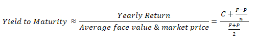
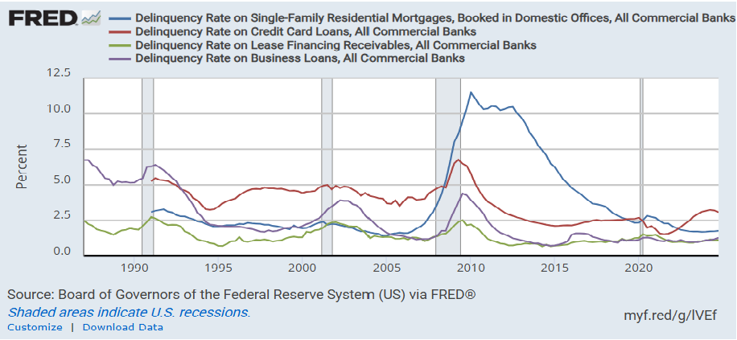
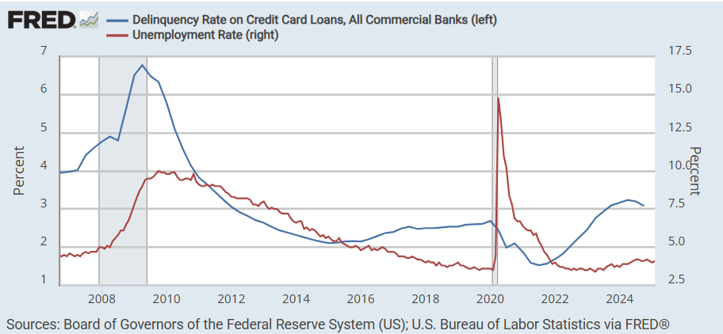
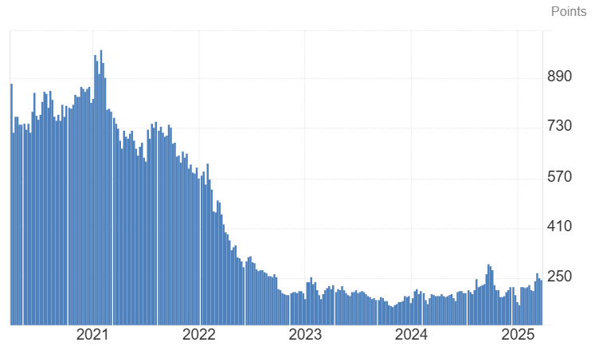

```{r setup, include=FALSE}
knitr::opts_chunk$set(echo = TRUE,warning = FALSE)
```


# 1. Introduction

In this data analysis project we will be focusing on the U.S. economy and its interrelationship to real estate market. We will be analyzing data from various economic indicators to analyze the health of the economy. This is also a interest of mine to better understand the US economy and why certain factors are the way they are. As I reside in Hawaii I also would like to better improve my understanding of the local economy and how that relates to the local real estate market in the islands. I also hope that this project can help others in understanding the U.S. economy and real estate market as well.  I will do my best to explain various concepts in a clear and easy-to-understand way.


# 2. Guided Questions

Project Task: This data analysis project will explore the following key questions to build a comprehensive understanding of the U.S. economy, with a particular focus on how these factors influence the real estate market nationally and in Hawaii.

1. Understanding Core Economic Concepts

&nbsp;&nbsp;&nbsp;&nbsp;&nbsp;&nbsp;&nbsp;&nbsp;&nbsp;&nbsp;&nbsp;&nbsp;&nbsp;&nbsp;&nbsp;&nbsp;a.	What is inflation, and how does it impact the economy?

&nbsp;&nbsp;&nbsp;&nbsp;&nbsp;&nbsp;&nbsp;&nbsp;&nbsp;&nbsp;&nbsp;&nbsp;&nbsp;&nbsp;&nbsp;&nbsp;b.	What are U.S. treasury bonds and their maturity rates?

&nbsp;&nbsp;&nbsp;&nbsp;&nbsp;&nbsp;&nbsp;&nbsp;&nbsp;&nbsp;&nbsp;&nbsp;&nbsp;&nbsp;&nbsp;&nbsp;c.	How do federal interest rates relate to mortgage rates?

2. Exploring key real estate indicators

&nbsp;&nbsp;&nbsp;&nbsp;&nbsp;&nbsp;&nbsp;&nbsp;&nbsp;&nbsp;&nbsp;&nbsp;&nbsp;&nbsp;&nbsp;&nbsp;a.	How do mortgage application rates, real estate prices, inventory levels, and Days on Market assess the health of the real estate market?

&nbsp;&nbsp;&nbsp;&nbsp;&nbsp;&nbsp;&nbsp;&nbsp;&nbsp;&nbsp;&nbsp;&nbsp;&nbsp;&nbsp;&nbsp;&nbsp;b.	What does the foreclosure rate reveal about economic stability?

3. How do inflation, bond yields, and federal interest rates collectively influence the real estate market?

4. How does the national economy compare to Hawaii’s economy, and how do these differences impact Hawaii’s real estate market?

5. How can we identify a potential bubble in the real estate market?

6. How can understanding these factors help guide future real estate decisions?

# 3. Data Preparation

The data used in this analysis was acquired from following sources. It is directly downloaded from their designated sites. All data sets are acquired from reputable source used in data analysis.

3.1 Download the libraries used to work with this data.


```{r library, warning=FALSE,include=FALSE}

# 3.1 Library used installations:

# install.packages("tidytuesdayR")
# install.packages("tidyverse")
# install.packages("dplyr")
# install.packages("janitor")
# install.packages("skimr")
# install.packages("lubridate")
# install.packages("ggpubr")
# install.packages("data.table")
# install.packages("viridis")
# install.packages("leaflet")
# install.packages("htmlwidgets")
# install.packages("htmltools")
# install.packages("kableExtra")
# install.packages("here")
# install.packages("visdat")
# install.packages("readxl")
# install.packages("tidyr")
# install.packages("scales")
# install.packages("plotly")
# install.packages("forecast")
# install.packages("gridExtra")
# install.packages("formattable")
#install.packages("ggbreak")
#install.packages("naniar")
#install.packages("zoo")
#install.packages("imputeTS")


library ("tidytuesdayR")
library("tidyverse")
library("dplyr")
library("janitor")
library("skimr")
library("lubridate")
library("ggpubr")
library("data.table")
library("viridis")
library("leaflet")
library("htmlwidgets")
library("htmltools")
library("kableExtra")
library("here")
library("ggrepel")
library("ggbreak")
library("naniar")
library("ggplot2")
library("plotly")
library(plotly)
library(zoo)
```

&nbsp;&nbsp;&nbsp;&nbsp;&nbsp;&nbsp;&nbsp;&nbsp;&nbsp;&nbsp;&nbsp;&nbsp;&nbsp;&nbsp;&nbsp;&nbsp;Housing Inventory [source Zillow](https://www.zillow.com/research/data/)
```{R Download_data, include= FALSE}

#3.1 download Raw data

# options(timeout=300)   #used to prevent time out if i takes too long 
# # 4.2 download Raw data
# url <- "https://files.zillowstatic.com/research/public_csvs/invt_fs/Metro_invt_fs_uc_sfrcondo_month.csv?t=1730744841"
# download.file(url, "temp_data.csv")  # save as CSV, not ZIP
# inventory_data <- read.csv("temp_data.csv")     # read the downloaded CSV file


# Load the CSV file from the 'R_Econ_Data' folder
inventory_data  <- read.csv(here("R_Econ_Data", "Metro_invt_fs_uc_sfrcondo_month.csv"))


# Reshape from wide to long format
long_inventory <- inventory_data %>%
  pivot_longer(
    cols = starts_with("X"),     # Adjust to match the column names with 'X' prefix
    names_to = "Date",            # Create a new 'Date' column
    values_to = "Inventory"       # Move values into 'Inventory' column
  )

# Optional: Remove the 'X' from the 'Date' column for better formatting
long_inventory$Date <- gsub("^X", "", long_inventory$Date)  # Remove leading 'X'
long_inventory$Date <- as.Date(long_inventory$Date, format = "%Y.%m.%d")  # Convert to Date format


#url <- "https://divvy-tripdata.s3.amazonaws.com/202111-divvy-tripdata.zip"
#download.file(url, "temp_data.zip") 
#unzip("temp_data.zip")
#df1 <- read.csv("202111-divvy-tripdata.csv")

# Combine all 12 data file into one data set
# <- rbind(df1,df2)

# produce an overview of the data
#str(bike_rides)

#skim_without_charts(bike_rides)

#glimpse(bike_rides)


```


&nbsp;&nbsp;&nbsp;&nbsp;&nbsp;&nbsp;&nbsp;&nbsp;&nbsp;&nbsp;&nbsp;&nbsp;&nbsp;&nbsp;&nbsp;&nbsp;Days in Market [source- Zillow](https://www.zillow.com/research/data/)
```{R days_pending_data, include= FALSE}
#3.2 download Raw data days pending


options(timeout=300)   #used to prevent time out if i takes too long


# url <- "https://files.zillowstatic.com/research/public_csvs/mean_doz_pending/Metro_mean_doz_pending_uc_sfrcondo_month.csv?t=1730744841"
# download.file(url, "temp_data.csv")  # save as CSV, not ZIP
# days_pnd_data <- read.csv("temp_data.csv")     # read the downloaded CSV file


days_pnd_data <- read.csv(here("R_Econ_Data", "Metro_mean_doz_pending_uc_sfrcondo_month.csv"))


# Reshape from wide to long
long_pending <- days_pnd_data %>%
  pivot_longer(
    cols = starts_with("X"),
    names_to = "Date",
    values_to = "Pending"
  ) %>%
  mutate(
    Date = gsub("^X", "", Date),                       # Remove leading 'X'
    Date = as.Date(Date, format = "%Y.%m.%d")          # Correct format for date parsing
  )

# Check results
summary(long_pending$Date)
any(is.na(long_pending$Date))  # Should return FALSE

#write.csv(days_pnd_data, "days_pnd_data.csv", row.names = FALSE)

```


&nbsp;&nbsp;&nbsp;&nbsp;&nbsp;&nbsp;&nbsp;&nbsp;&nbsp;&nbsp;&nbsp;&nbsp;&nbsp;&nbsp;&nbsp;&nbsp;Mortgage Application [source- Federal Financial Institutions Examination Council](https://ffiec.cfpb.gov/data-browser/data/2023?category=states&items=HI)
```{R Download_data_mort_app, include= FALSE}

#3.3 download Raw mortgage 

#options(timeout=300) 
# url <- "https://cfpb-hmda-public.s3.amazonaws.com/prod/data-browser/2023/filtered-queries/snapshot/83bbcb7a28f2a289eca9ec4043afca38.csv"
# download.file(url, "temp_data.csv")  # save as CSV, not ZIP
# mortapp23_data <- read.csv("temp_data.csv")     # read the downloaded CSV file
# 
# url <- "https://cfpb-hmda-public.s3.amazonaws.com/prod/data-browser/2022/filtered-queries/one-year/83bbcb7a28f2a289eca9ec4043afca38.csv"
# download.file(url, "temp_data.csv")  # save as CSV, not ZIP
# mortapp22_data <- read.csv("temp_data.csv")     # read the downloaded CSV file
# 
# url <- "https://cfpb-hmda-public.s3.amazonaws.com/prod/data-browser/2021/filtered-queries/one-year/83bbcb7a28f2a289eca9ec4043afca38.csv"
# download.file(url, "temp_data.csv")  # save as CSV, not ZIP
# mortapp21_data <- read.csv("temp_data.csv")     # read the downloaded CSV file
# 
# url <- "https://cfpb-hmda-public.s3.amazonaws.com/prod/data-browser/2020/filtered-queries/three-year/83bbcb7a28f2a289eca9ec4043afca38.csv"
# download.file(url, "temp_data.csv")  # save as CSV, not ZIP
# mortapp20_data <- read.csv("temp_data.csv")     # read the downloaded CSV file
# 
# url <- "https://cfpb-hmda-public.s3.amazonaws.com/prod/data-browser/2019/filtered-queries/three-year/83bbcb7a28f2a289eca9ec4043afca38.csv"
# download.file(url, "temp_data.csv")  # save as CSV, not ZIP
# mortapp19_data <- read.csv("temp_data.csv")     # read the downloaded CSV file
# 
# url <- "https://cfpb-hmda-public.s3.amazonaws.com/prod/data-browser/2018/filtered-queries/three-year/83bbcb7a28f2a289eca9ec4043afca38.csv"
# download.file(url, "temp_data.csv")  # save as CSV, not ZIP
# mortapp18_data <- read.csv("temp_data.csv")     # read the downloaded CSV file

# Load the CSV file from the 'E_Econ_Data' folder
mortapp23_data <- read.csv(here("R_Econ_Data", "state_HI_2023.csv"))
mortapp22_data <- read.csv(here("R_Econ_Data", "state_HI_2022.csv"))
mortapp21_data <- read.csv(here("R_Econ_Data", "state_HI_2021.csv"))
mortapp20_data <- read.csv(here("R_Econ_Data", "state_HI_2020.csv"))
mortapp19_data <- read.csv(here("R_Econ_Data", "state_HI_2019.csv"))
mortapp18_data <- read.csv(here("R_Econ_Data", "state_HI_2018.csv"))

#Combine all 12 data file into one data set
 mortapp_hi<- rbind(mortapp23_data,mortapp22_data,mortapp21_data,mortapp20_data,mortapp19_data,mortapp18_data)

rm(mortapp23_data,mortapp22_data,mortapp21_data,mortapp20_data,mortapp19_data,mortapp18_data)
```

&nbsp;&nbsp;&nbsp;&nbsp;&nbsp;&nbsp;&nbsp;&nbsp;&nbsp;&nbsp;&nbsp;&nbsp;&nbsp;&nbsp;&nbsp;&nbsp;Mortgage Rate [source- Federal Reserve Economic Data by St. Louis Fed](https://fred.stlouisfed.org/series/OBMMIC30YFLVGT80FB720A739)
```{R mort_rate_data, include= FALSE}

#3.4 download Raw mortgage rate
# options(timeout=300)
# url <- "https://fred.stlouisfed.org/graph/fredgraph.csv?bgcolor=%23e1e9f0&chart_type=line&drp=0&fo=open%20sans&graph_bgcolor=%23ffffff&height=450&mode=fred&recession_bars=on&txtcolor=%23444444&ts=12&tts=12&width=1140&nt=0&thu=0&trc=0&show_legend=yes&show_axis_titles=yes&show_tooltip=yes&id=MORTGAGE30US&scale=left&cosd=1971-04-02&coed=2025-04-25&line_color=%234572a7&link_values=false&line_style=solid&mark_type=none&mw=3&lw=3&ost=-99999&oet=99999&mma=0&fml=a&fq=Weekly%2C%20Ending%20Thursday&fam=avg&fgst=lin&fgsnd=2020-02-01&line_index=1&transformation=lin&vintage_date=2025-04-24&revision_date=2025-04-24&nd=1971-04-02"
# 
# 
# 
# download.file(url, "temp_data.csv")  # save as CSV, not ZIP
# mort_rate_data<- read.csv("temp_data.csv")     # read the downloaded CSV file


mort_rate_data <- read.csv(here("R_Econ_Data", "MORTGAGE30US.csv"))

#head(infl_rate_data_cl)

```

&nbsp;&nbsp;&nbsp;&nbsp;&nbsp;&nbsp;&nbsp;&nbsp;&nbsp;&nbsp;&nbsp;&nbsp;&nbsp;&nbsp;&nbsp;&nbsp;Real Estate Prices [source- Realtor.com](https://www.realtor.com/research/data/)
```{R mort_prices_data, include= FALSE}

#3.5 download Raw Mort. Price

# options(timeout=300) 
# url <- "https://econdata.s3-us-west-2.amazonaws.com/Reports/Core/RDC_Inventory_Core_Metrics_Country_History.csv"
# download.file(url, "temp_data.csv")  # save as CSV, not ZIP
# price_Nat__data  <- read.csv("temp_data.csv")     # read the downloaded CSV file
# 
# url <- "https://econdata.s3-us-west-2.amazonaws.com/Reports/Core/RDC_Inventory_Core_Metrics_Metro_History.csv"
# download.file(url, "temp_data.csv")  # save as CSV, not ZIP
# price_Hi__data <- read.csv("temp_data.csv")     # read the downloaded CSV file


price_Nat__data <- read.csv(here("R_Econ_Data", "RDC_Inventory_Core_Metrics_Country_History.csv"))
#median listing price, active listing count, days in market, new listing count, price increase count, 
#price decrease count, median listing price sqft, ave listing price,total listing count,

price_Hi__data <- read.csv(here("R_Econ_Data", "RDC_Inventory_Core_Metrics_County_History.csv"))


# Convert 'month_date_yyyymm' to Date format
price_Nat__data$month_date_yyyymm <- as.Date(paste0(substr(price_Nat__data$month_date_yyyymm, 1, 4), "-",
                                                    substr(price_Nat__data$month_date_yyyymm, 5, 6), "-01"))

price_Hi__data$month_date_yyyymm <- as.Date(paste0(substr(price_Hi__data$month_date_yyyymm, 1, 4), "-",
                                                   substr(price_Hi__data$month_date_yyyymm, 5, 6), "-01"))


# Filter for Hawaii counties in price_Hi__data by identifying 'hi' in county_name
price_Hi_filtered <- price_Hi__data %>%
  filter(grepl(", hi", county_name, ignore.case = TRUE))

# Select relevant columns for merging
price_Nat_selected <- price_Nat__data %>%
  select(month_date_yyyymm, median_listing_price)

price_Hi_selected <- price_Hi_filtered %>%
  select(month_date_yyyymm, county_name, median_listing_price)

# Merge data on 'month_date_yyyymm' to combine country and Hawaii data
combined_data_price <- merge(price_Nat_selected, price_Hi_selected, by = "month_date_yyyymm", 
                       suffixes = c("_country", "_hi"))

# View the combined data
#print(combined_data)

rm(price_Hi_filtered ,price_Nat_selected,price_Nat__data , price_Hi__data  )

#write.csv(combined_data, "combined_data.csv", row.names = FALSE)
```


&nbsp;&nbsp;&nbsp;&nbsp;&nbsp;&nbsp;&nbsp;&nbsp;&nbsp;&nbsp;&nbsp;&nbsp;&nbsp;&nbsp;&nbsp;&nbsp;Foreclosure Rate [source 1](https://fred.stlouisfed.org/series/DRSFRMACBS), [source 2](https://fred.stlouisfed.org/series/RCMFLBACTDPDPCT90P)
```{R forclosure, include= FALSE}


#3.6 download Raw Forclosure
# options(timeout=300) 
# url <- "https://fred.stlouisfed.org/graph/fredgraph.csv?bgcolor=%23ebf3fb&chart_type=line&drp=0&fo=open%20sans&graph_bgcolor=%23ffffff&height=450&mode=fred&recession_bars=on&txtcolor=%23444444&ts=12&tts=12&width=1140&nt=0&thu=0&trc=0&show_legend=yes&show_axis_titles=yes&show_tooltip=yes&id=DRSFRMACBS&scale=left&cosd=1991-01-01&coed=2025-04-24&line_color=%230073e6&link_values=false&line_style=solid&mark_type=none&mw=3&lw=3&ost=-99999&oet=99999&mma=0&fml=a&fq=Quarterly%2C%20End%20of%20Period&fam=avg&fgst=lin&fgsnd=2020-02-01&line_index=1&transformation=lin&vintage_date=2025-04-22&revision_date=2025-04-22&nd=1991-01-011"


# download.file(url, "temp_data.csv")  # save as CSV, not ZIP
# forclosure__data  <- read.csv("temp_data.csv")     # read the downloaded CSV file

foreclosure_data <- read.csv(here("R_Econ_Data", "DRSFRMACBS.csv"))


# options(timeout=300) 
# url <- "https://fred.stlouisfed.org/graph/fredgraph.csv?bgcolor=%23e1e9f0&chart_type=line&drp=0&fo=open%20sans&graph_bgcolor=%23ffffff&height=450&mode=fred&recession_bars=on&txtcolor=%23444444&ts=12&tts=12&width=1140&nt=0&thu=0&trc=0&show_legend=yes&show_axis_titles=yes&show_tooltip=yes&id=RCMFLBACTDPDPCT90P&scale=left&cosd=2012-07-01&coed=2025-04-24&line_color=%234572a7&link_values=false&line_style=solid&mark_type=none&mw=3&lw=2&ost=-99999&oet=99999&mma=0&fml=a&fq=Quarterly%2C%20End%20of%20Quarter&fam=avg&fgst=lin&fgsnd=2020-02-01&line_index=1&transformation=lin&vintage_date=2025-04-24&revision_date=2024-11-19&nd=2012-07-01"
# download.file(url, "temp_data.csv")  # save as CSV, not ZIP
# forclosure__data  <- read.csv("temp_data.csv")     # read the downloaded CSV file

foreclosure90_data <- read.csv(here("R_Econ_Data", "RCMFLBACTDPDPCT90P.csv"))

```

&nbsp;&nbsp;&nbsp;&nbsp;&nbsp;&nbsp;&nbsp;&nbsp;&nbsp;&nbsp;&nbsp;&nbsp;&nbsp;&nbsp;&nbsp;&nbsp;Household Income [source- Hawaii-Federal Reserve Economic Data by St. Louis Fed](https://fred.stlouisfed.org/series/MEHOINUSHIA646N) and [National Data by Fred](https://fred.stlouisfed.org/series/MEHOINUSA646N)
```{R household_income_data, include= FALSE}

#3.7 download Raw Household income
# options(timeout=300) 
# url <- "https://fred.stlouisfed.org/graph/fredgraph.csv?bgcolor=%23e1e9f0&chart_type=line&drp=0&fo=open%20sans&graph_bgcolor=%23ffffff&height=450&mode=fred&recession_bars=on&txtcolor=%23444444&ts=12&tts=12&width=1140&nt=0&thu=0&trc=0&show_legend=yes&show_axis_titles=yes&show_tooltip=yes&id=MEHOINUSHIA646N&scale=left&cosd=1984-01-01&coed=2025-04-24&line_color=%234572a7&link_values=false&line_style=solid&mark_type=none&mw=3&lw=2&ost=-99999&oet=99999&mma=0&fml=a&fq=Annual&fam=avg&fgst=lin&fgsnd=2020-02-01&line_index=1&transformation=lin&vintage_date=2024-11-04&revision_date=2025-04-24&nd=1984-01-01"
#  download.file(url, "temp_data.csv")  # save as CSV, not ZIP
# df6 <- read.csv("temp_data.csv")     # read the downloaded CSV file


#house hold income hawaii
hhi_income_data <- read.csv(here("R_Econ_Data", "MEHOINUSHIA646N.csv"))

# Assuming df is your data frame
hhi_income_data <- hhi_income_data %>%
  rename(income_hi = MEHOINUSHIA646N)

# options(timeout=300) 
# url <- "https://fred.stlouisfed.org/graph/fredgraph.csv?bgcolor=%23e1e9f0&chart_type=line&drp=0&fo=open%20sans&graph_bgcolor=%23ffffff&height=450&mode=fred&recession_bars=on&txtcolor=%23444444&ts=12&tts=12&width=1140&nt=0&thu=0&trc=0&show_legend=yes&show_axis_titles=yes&show_tooltip=yes&id=MEHOINUSA646N&scale=left&cosd=1984-01-01&coed=2025-04-24&line_color=%234572a7&link_values=false&line_style=solid&mark_type=none&mw=3&lw=2&ost=-99999&oet=99999&mma=0&fml=a&fq=Annual&fam=avg&fgst=lin&fgsnd=2020-02-01&line_index=1&transformation=lin&vintage_date=2024-11-04&revision_date=2025-04-24&nd=1984-01-01"
# download.file(url, "temp_data.csv")  # save as CSV, not ZIP
# husa_income_data <- read.csv("temp_data.csv")     # read the downloaded CSV file


#house hold income national 
husa_income_data <- read.csv(here("R_Econ_Data", "MEHOINUSA646N.csv"))

```


&nbsp;&nbsp;&nbsp;&nbsp;&nbsp;&nbsp;&nbsp;&nbsp;&nbsp;&nbsp;&nbsp;&nbsp;&nbsp;&nbsp;&nbsp;&nbsp;Inflation Rate [source- Federal Reserve Economic Data by St. Louis Fed](https://fred.stlouisfed.org/series/CPILFESL) and [source 2](https://fred.stlouisfed.org/series/CPIAUCSL)
```{R infl_rate_data, include= FALSE}

#3.8 download Raw inflation data
# options(timeout=300) 
# url <- "https://fred.stlouisfed.org/graph/fredgraph.csv?bgcolor=%23e1e9f0&chart_type=line&drp=0&fo=open%20sans&graph_bgcolor=%23ffffff&height=450&mode=fred&recession_bars=on&txtcolor=%23444444&ts=12&tts=12&width=1140&nt=0&thu=0&trc=0&show_legend=yes&show_axis_titles=yes&show_tooltip=yes&id=CPILFESL&scale=left&cosd=1957-01-01&coed=2025-04-24&line_color=%234572a7&link_values=false&line_style=solid&mark_type=none&mw=3&lw=2&ost=-99999&oet=99999&mma=0&fml=a&fq=Monthly&fam=avg&fgst=lin&fgsnd=2020-02-01&line_index=1&transformation=lin&vintage_date=2024-11-04&revision_date=2025-04-24&nd=1957-01-01"
# download.file(url, "temp_data.csv")  # save as CSV, not ZIP
# infl_rate_data  <- read.csv("temp_data.csv")     # read the downloaded CSV file


infl_rate_data <- read.csv(here("R_Econ_Data", "CPILFESL.csv"))


# options(timeout=300) 
# url <- "https://fred.stlouisfed.org/graph/fredgraph.csv?bgcolor=%23e1e9f0&chart_type=line&drp=0&fo=open%20sans&graph_bgcolor=%23ffffff&height=450&mode=fred&recession_bars=on&txtcolor=%23444444&ts=12&tts=12&width=1140&nt=0&thu=0&trc=0&show_legend=yes&show_axis_titles=yes&show_tooltip=yes&id=CPIAUCSL&scale=left&cosd=1947-01-01&coed=2025-04-24&line_color=%234572a7&link_values=false&line_style=solid&mark_type=none&mw=3&lw=3&ost=-99999&oet=99999&mma=0&fml=a&fq=Monthly&fam=avg&fgst=lin&fgsnd=2020-02-01&line_index=1&transformation=lin&vintage_date=2025-01-15&revision_date=2025-04-24&nd=1947-01-01"
# download.file(url, "temp_data.csv")  # save as CSV, not ZIP
# infl_rate_data_2  <- read.csv("temp_data.csv")     # read the downloaded CSV file

infl_rate_data_2 <-read.csv(here("R_Econ_Data", "CPIAUCSL.csv"))


```

&nbsp;&nbsp;&nbsp;&nbsp;&nbsp;&nbsp;&nbsp;&nbsp;&nbsp;&nbsp;&nbsp;&nbsp;&nbsp;&nbsp;&nbsp;&nbsp;Bond Market Yield Rate [source- Federal Reserve Economic Data by St. Louis Fed](https://fred.stlouisfed.org/series/DGS10)
```{R bond_rate_data, include= FALSE}

# options(timeout=300) 
# url <- "https://fred.stlouisfed.org/graph/fredgraph.csv?bgcolor=%23ebf3fb&chart_type=line&drp=0&fo=open%20sans&graph_bgcolor=%23ffffff&height=450&mode=fred&recession_bars=on&txtcolor=%23444444&ts=12&tts=12&width=1320&nt=0&thu=0&trc=0&show_legend=yes&show_axis_titles=yes&show_tooltip=yes&id=DGS10&scale=left&cosd=1962-01-02&coed=2025-04-23&line_color=%230073e6&link_values=false&line_style=solid&mark_type=none&mw=3&lw=3&ost=-99999&oet=99999&mma=0&fml=a&fq=Daily&fam=avg&fgst=lin&fgsnd=2020-02-01&line_index=1&transformation=lin&vintage_date=2025-04-24&revision_date=2025-04-24&nd=1962-01-02"
# download.file(url, "temp_data.csv")  # save as CSV, not ZIP
# bond_mkty_rate_data <- read.csv("temp_data.csv")     # read the downloaded CSV file


bond_mkty_rate_data <- read.csv(here("R_Econ_Data", "DGS10.csv"))

```


```{R f_interest_r, include= FALSE}

#3.9 download Raw Fed interest rate
# options(timeout=300) 
# url <- "https://fred.stlouisfed.org/graph/fredgraph.csv?bgcolor=%23e1e9f0&chart_type=line&drp=0&fo=open%20sans&graph_bgcolor=%23ffffff&height=450&mode=fred&recession_bars=on&txtcolor=%23444444&ts=12&tts=12&width=1140&nt=0&thu=0&trc=0&show_legend=yes&show_axis_titles=yes&show_tooltip=yes&id=FEDFUNDS&scale=left&cosd=1954-07-01&coed=2025-04-24&line_color=%234572a7&link_values=false&line_style=solid&mark_type=none&mw=3&lw=3&ost=-99999&oet=99999&mma=0&fml=a&fq=Monthly&fam=avg&fgst=lin&fgsnd=2020-02-01&line_index=1&transformation=lin&vintage_date=2025-01-22&revision_date=2025-04-24&nd=1954-07-01"

# download.file(url, "temp_data.csv")  # save as CSV, not ZIP
# fedi_rate <- read.csv("temp_data.csv")     # read the downloaded CSV file

fedi_rate <- read.csv(here("R_Econ_Data", "FEDFUNDS.csv"))

```


&nbsp;&nbsp;&nbsp;&nbsp;&nbsp;&nbsp;&nbsp;&nbsp;&nbsp;&nbsp;&nbsp;&nbsp;&nbsp;&nbsp;&nbsp;&nbsp;Personal Saving Rate [source- Fred](https://fred.stlouisfed.org/series/PSAVERT)
```{R Savings, include= FALSE}


#3.10 download Raw savings
# options(timeout=300) 

# url <- "https://fred.stlouisfed.org/graph/fredgraph.csv?bgcolor=%23e1e9f0&chart_type=line&drp=0&fo=open%20sans&graph_bgcolor=%23ffffff&height=450&mode=fred&recession_bars=on&txtcolor=%23444444&ts=12&tts=12&width=1140&nt=0&thu=0&trc=0&show_legend=yes&show_axis_titles=yes&show_tooltip=yes&id=FEDFUNDS&scale=left&cosd=1954-07-01&coed=2025-04-24&line_color=%234572a7&link_values=false&line_style=solid&mark_type=none&mw=3&lw=3&ost=-99999&oet=99999&mma=0&fml=a&fq=Monthly&fam=avg&fgst=lin&fgsnd=2020-02-01&line_index=1&transformation=lin&vintage_date=2025-01-22&revision_date=2025-04-24&nd=1954-07-01"

# download.file(url, "temp_data.csv")  # save as CSV, not ZIP
# savings <- read.csv("temp_data.csv")     # read the downloaded CSV file

savings <- read.csv(here("R_Econ_Data", "PSAVERT.csv"))

```


# 4. Process and Clean Data


This section outlines the steps taken to prepare the dataset for analysis. The goal is to ensure that the data is clean, properly formatted, and ready for meaningful interpretation. Each step—such as renaming columns, checking for missing values, standardizing formats, and identifying outliers—has been carefully documented in the appendix so the readers can understand and, if desired, replicate the data cleaning process themselves.


```{R cap_10, include=FALSE}


#4.1 cap_10

homevalue <- read.csv(here("R_Econ_Data", "Metro_zhvi_uc_sfrcondo_tier_0.33_0.67_month.csv"))

# Reshape from wide to long format
L_homevalue <- homevalue %>%
  pivot_longer(
    cols = starts_with("X"),     # Adjust to match the column names with 'X' prefix
    names_to = "Date",            # Create a new 'Date' column
    values_to = "Value_dollers"       # Move values into 'Inventory' column
  )

# Optional: Remove the 'X' from the 'Date' column for better formatting
L_homevalue$Date <- gsub("^X", "", L_homevalue$Date)  # Remove leading 'X'
L_homevalue$Date <- as.Date(L_homevalue$Date, format = "%Y.%m.%d")  # Convert to Date format

# Create a new column with Month-Year only for display
L_homevalue$Month_Year <- format(L_homevalue$Date, "%m-%Y")  # Format as "Year-Month"

rm(homevalue)


# Rental value
rental <- read.csv(here("R_Econ_Data", "Metro_zori_uc_sfrcondomfr_sm_month.csv"))

# Reshape from wide to long format
L_rental<- rental %>%
  pivot_longer(
    cols = starts_with("X"),     # Adjust to match the column names with 'X' prefix
    names_to = "Date",            # Create a new 'Date' column
    values_to = "rent_dollers"       # Move values into 'Inventory' column
  )

# Optional: Remove the 'X' from the 'Date' column for better formatting
L_rental$Date <- gsub("^X", "", L_rental$Date)  # Remove leading 'X'
L_rental$Date <- as.Date(L_rental$Date, format = "%Y.%m.%d")  # Convert to Date format

# Create a new column with Month-Year only for display
L_rental$Month_Year <- format(L_rental$Date, "%m-%Y")  # Format as "Year-Month"

rm(rental)


# Filter for home values
L_homevalue_f <- L_homevalue %>%
  filter(grepl("United States", RegionName, ignore.case = TRUE))

L_rental_f <- L_rental %>%
  filter(grepl("United States", RegionName, ignore.case = TRUE))

# Select relevant columns for merging
L_rental_f <- L_rental_f %>%
  select(Month_Year, RegionName, rent_dollers)

L_homevalue_f<- L_homevalue_f %>%
  select(Month_Year, RegionName, Value_dollers)

# Merge data on 'month_date_yyyymm' to combine country and Hawaii data
cap_data <- merge(L_rental_f, L_homevalue_f, by = "Month_Year", 
                       suffixes = c("_rental", "_homevalue"))  
cap_data <- cap_data %>%
  mutate(monthly_exp = rent_dollers * 0.40)

cap_data <- cap_data %>%
  mutate(cap=(rent_dollers-monthly_exp)/Value_dollers)

cap_data <- cap_data %>%
  mutate(Month_Year = as.Date(paste0(Month_Year, "-01"), format = "%m-%Y-%d"))

rm(L_homevalue_f, L_rental_f)


```

4.2 Clean up column names for proper formatting 
```{r clean_column, eval=TRUE, include= FALSE}
# 
# # 4.2 make all column names text with proper formatting
long_inventory_cl<-clean_names(long_inventory)
long_pending_cl<-clean_names(long_pending)
mortapp_hi_cl<-clean_names(mortapp_hi)
mort_rate_data_cl<-clean_names(mort_rate_data)

#delete later
combined_data_price_cl<-clean_names(combined_data_price)

foreclosure_data_cl<-clean_names(foreclosure_data)
foreclosure90_data_cl<-clean_names(foreclosure90_data)
hhi_income_data_cl<-clean_names(hhi_income_data)
husa_income_data_cl<-clean_names(husa_income_data)
infl_rate_data_cl<-clean_names(infl_rate_data)
bond_mkty_rate_data_cl<-clean_names(bond_mkty_rate_data)
savings_cl <-clean_names(savings)

#rm(long_inventory,long_pending,mortapp_hi,mort_rate_data,foreclosure_data,foreclosure90_data,hhi_income_data,husa_income_data,infl_rate_data,bond_mkty_rate_data)

# Rename day to YMD:
#numbats <- numbats %>% rename(YMD = day)

```


4.3 Check to make sure all numbers are formatted correctly.
```{r number_format_check, eval=TRUE, include= FALSE}
# 4.3 the following checks all columns if numeric:
sapply(long_inventory_cl ,is.numeric)
sapply(long_pending_cl ,is.numeric)
sapply(mortapp_hi_cl ,is.numeric)

# this data found to be non numeric and found to have NA: NA blank are deleted first before proper numeric formatting
sapply(mort_rate_data_cl ,is.numeric)

sapply(combined_data_price_cl,is.numeric)
sapply(foreclosure_data_cl ,is.numeric)
sapply(foreclosure90_data_cl ,is.numeric)
sapply(hhi_income_data_cl ,is.numeric)
sapply(husa_income_data_cl ,is.numeric)
sapply(infl_rate_data_cl ,is.numeric)
sapply(bond_mkty_rate_data_cl ,is.numeric)
sapply(savings_cl, is.numeric)

```

4.5 Check any missing data
```{r missing_data_check, eval=TRUE, include= FALSE}

#4.5 Check any missing data
# Function to visualize missingness and compute summary stats
visualize_missingness_all <- function(dataframes_list) {
  plots <- list() # Initialize a list to store plots
  
  # Iterate over each dataframe in the list
  for (name in names(dataframes_list)) {
    data <- dataframes_list[[name]]
    
    # Visualize missing data patterns
      plot <- vis_miss(data) +
      ggtitle(paste("Missing Data Visualization for", name)) +
      theme_minimal() +
      theme(axis.text.x = element_text(angle = 45, hjust = 0)) # Slant x-axis labels
    print(plot) # Display each plot
    
    # Calculate missing percentages
    missing_percents <- sapply(data, function(x) mean(is.na(x))) * 100
    
    # Create a data frame for display
    missing_df <- data.frame(
      Column = names(missing_percents),
      MissingPercentage = round(missing_percents, 2)
    )
    
    # Display the table
    print(
      kable(missing_df, caption = paste("Percentage of Missing Values by Column -", name)) %>%
        kable_styling(bootstrap_options = c("striped", "hover"), full_width = F)
    )
    
    # Save the plot in the list
    plots[[name]] <- plot
  }
  
  return(plots) # Return the list of plots
}

# Define the list of dataframes
dataframes_econ <- list(
  df1 = long_inventory_cl,
  df2 = long_pending_cl,
  #df3 = mortapp_hi_cl,
  df4 = mort_rate_data_cl,
  df5 = combined_data_price_cl,
  df6 = foreclosure_data_cl,
  df7 = foreclosure90_data_cl,
  df8 = hhi_income_data_cl,
  df9 = husa_income_data_cl,
  df10 = infl_rate_data_cl,
  df11 = bond_mkty_rate_data_cl,
  df12= savings_cl
)

# Call the function and generate visualizations for all dataframes
plots <- visualize_missingness_all(dataframes_econ)

# Optional: Save plots to files
# lapply(names(plots), function(name) {
#   ggsave(filename = paste0(name, "_missingness_plot.png"), plot = plots[[name]])
# })
```


4.6 Delete any rows with NA in the data
```{r delete_NA, eval=TRUE, include= FALSE}
#4.6 Delete any rows with NA in the data
# Combine dataframes into a named list
dataframes_econ <- list(
  df1 = long_inventory_cl,
  df2 = long_pending_cl,
# will ignore mortapp_hi_cl has many NA due to how its formated
  #df3 = mortapp_hi_cl,
  df4 = mort_rate_data_cl,
  df5 = combined_data_price_cl,
  df6 = foreclosure_data_cl,
  df7 = foreclosure90_data_cl,
  df8 = hhi_income_data_cl,
  df9 = husa_income_data_cl,
  df10 = infl_rate_data_cl,
  df11 = bond_mkty_rate_data_cl,
  df12 = savings_cl
)

# Apply na.omit to each dataframe in the list
Cleaned_dataframes_cl_econ <- lapply(dataframes_econ, na.omit)

# Access cleaned dataframes by name
long_inventory_cl <- Cleaned_dataframes_cl_econ$df1
long_pending_cl <- Cleaned_dataframes_cl_econ$df2
#mortapp_hi_cl <- Cleaned_dataframes_cl_econ$df3
mort_rate_data_cl <- Cleaned_dataframes_cl_econ$df4
combined_data_price_cl <- Cleaned_dataframes_cl_econ$df5
foreclosure_data_cl <- Cleaned_dataframes_cl_econ$df6
foreclosure90_data_cl <- Cleaned_dataframes_cl_econ$df7
hhi_income_data_cl <- Cleaned_dataframes_cl_econ$df8
husa_income_data_cl <- Cleaned_dataframes_cl_econ$df9
infl_rate_data_cl <- Cleaned_dataframes_cl_econ$df10
bond_mkty_rate_data_cl <- Cleaned_dataframes_cl_econ$df11
savings_cl <- Cleaned_dataframes_cl_econ$df12
```


4.7 Convert necessary data to numeric
```{r conv_num, eval=TRUE, include= FALSE}

#4.7 Convert necessary data to numeric
#mort_rate_data_cl was found to not be numeric, after NA removal, it can now be converted;
mort_rate_data_cl$mortgage30us <- as.numeric(mort_rate_data_cl$mortgage30us)


bond_mkty_rate_data_cl$dgs10 <- as.numeric(bond_mkty_rate_data_cl$dgs10)
```


4.8  Identify outliers in the raw data.
```{r outliers, eval=TRUE, include=FALSE, echo=FALSE, message=FALSE, warning=FALSE}
#4.8  Identify outliers in the raw data.
# Define the list of dataframes
dataframes_econ <- list(
  df1 = long_inventory_cl,
  df2 = long_pending_cl,
  df4 = mort_rate_data_cl,
  df5 = combined_data_price_cl, 
  df6 = foreclosure_data_cl,
  df7 = foreclosure90_data_cl,
  df8 = hhi_income_data_cl,
  df9 = husa_income_data_cl,
  df10 = infl_rate_data_cl,
  df11 = bond_mkty_rate_data_cl,   
  df12 = savings_cl
)

#head(mort_rate_data)

# Define focus columns (columns to check for outliers)
focus_columns <- list(
  df1 = "inventory",
  df2 = "pending",
  df4 = "mortgage30us",
  df5 = c("median_listing_price_hi", "median_listing_price_country"),
  df6 = "drsfrmacbs",
  df7 = "rcmflbactdpdpct90p",
  df8 = "income_hi",
  df9 = "mehoinusa646n",
  df10 = "cpilfesl",
  df11 = "dgs10",
  df12 = "psavert" 
)

# Define x-axis columns (columns to be used as x-axis)
x_axis_columns <- list(
  df1 = "date",
  df2 = "date",
  df4 = "observation_date",
  df5 = "month_date_yyyymm",
  df6 = "observation_date",
  df7 = "observation_date",
  df8 = "observation_date",
  df9 = "observation_date",
  df10 = "observation_date",
  df11 = "observation_date",
  df12 = "observation_date"
  
)

# Function to detect outliers in a single dataframe
detect_outliers <- function(df, focus_columns) {
  results <- list()
  
  for (column in focus_columns) {
    # Ensure the column exists
    if (!column %in% colnames(df)) {
      results[[column]] <- paste("Column", column, "not found in dataframe")
      next
    }
    
    # Ensure the column is numeric
    if (!is.numeric(df[[column]])) {
      results[[column]] <- paste("Column", column, "is not numeric")
      next
    }
    
    # Calculate quartiles and IQR
    Q1 <- quantile(df[[column]], 0.25, na.rm = TRUE)
    Q3 <- quantile(df[[column]], 0.75, na.rm = TRUE)
    IQR <- Q3 - Q1
    
    # Calculate lower and upper bounds
    lower_bound <- Q1 - 1.5 * IQR
    upper_bound <- Q3 + 1.5 * IQR
    
    # Identify outliers
    outliers <- which(df[[column]] < lower_bound | df[[column]] > upper_bound)
    outlier_values <- df[outliers, ]
    
    # Save results for the column
    results[[column]] <- list(
      num_outliers = length(outliers),
      outliers = outlier_values,
      lower_bound = lower_bound,
      upper_bound = upper_bound
    )
  }
  
  return(results)
}

# Apply the function to each dataframe using the specified focus columns
outlier_results <- mapply(
  FUN = detect_outliers,
  df = dataframes_econ,
  focus_columns = focus_columns,
  SIMPLIFY = FALSE
)

# Display the results for each dataframe (optional)
if (FALSE) {
  for (i in seq_along(outlier_results)) {
    cat("Results for", names(dataframes_econ)[i], ":\n")
    print(outlier_results[[i]])
    cat("\n")
  }
}

# Function to plot data with outliers highlighted and cleaned x-axis
plot_outliers <- function(data, x_col, y_col, lower_bound, upper_bound, df_name, max_labels = 10) {
  # Ensure both x_col and y_col exist in the dataframe
  if (!x_col %in% colnames(data)) {
    message(paste("X-axis column", x_col, "not found in", df_name))
    return(NULL)
  }
  if (!y_col %in% colnames(data)) {
    message(paste("Y-axis column", y_col, "not found in", df_name))
    return(NULL)
  }
  
  #Adjust x-axis tick labels
  x_breaks <- if (is.numeric(data[[x_col]])) {
    # For numeric x-axis
    pretty(data[[x_col]], n = max_labels)
  } else if (inherits(data[[x_col]], "Date")) {
    # For date x-axis
    seq(min(data[[x_col]], na.rm = TRUE), max(data[[x_col]], na.rm = TRUE), length.out = max_labels)
  } else {
    # For categorical x-axis, take unique levels
    unique(data[[x_col]])[seq(1, length(unique(data[[x_col]])), length.out = max_labels)]
  }
# the following code was used to debugg---------------------------------------------------
  
 # Adjust x-axis tick labels
# # 🧪 Debug: print summary of x_col to confirm it's valid
# print(paste("Checking:", df_name, "-", x_col))
# print(summary(data[[x_col]]))
# 
# # Adjust x-axis tick labels
# x_breaks <- if (is.numeric(data[[x_col]])) {
# 
#   pretty(data[[x_col]], n = max_labels)
# } else if (inherits(data[[x_col]], "Date")) {
#   x_min <- min(data[[x_col]], na.rm = TRUE)
#   x_max <- max(data[[x_col]], na.rm = TRUE)
#   
#   if (!is.finite(as.numeric(x_min)) || !is.finite(as.numeric(x_max))) {
#     warning(paste("Skipping plot for", df_name, "-", y_col, "due to invalid date range"))
#     return(NULL)
#   }
# 
#   seq(x_min, x_max, length.out = max_labels)
# } else {
#   unique_vals <- unique(data[[x_col]])
#   if (length(unique_vals) == 0) {
#     warning(paste("Skipping plot for", df_name, "-", y_col, "due to no x-axis values"))
#     return(NULL)
#   }
#   unique_vals[seq(1, length(unique_vals), length.out = max_labels)]
# }

  
#-----------------------------------------------  
  # Create the plot
  p <- ggplot(data, aes_string(x = x_col, y = y_col)) +
    geom_point(aes(color = (get(y_col) < lower_bound | get(y_col) > upper_bound))) +
    geom_hline(yintercept = lower_bound, linetype = "dashed", color = "blue") +
    geom_hline(yintercept = upper_bound, linetype = "dashed", color = "blue") +
    labs(
      title = paste("Outlier Visualization for", y_col, "in", df_name),
      x = x_col,
      y = y_col
    ) +
    scale_color_manual(values = c("FALSE" = "black", "TRUE" = "red"), guide = "none") +
    theme_minimal() +
    theme(
      axis.text.x = element_text(angle = 45, hjust = 1, size = 8)  # Adjust label rotation and size
    )
  
  # Add adjusted breaks for the x-axis
  if (is.numeric(data[[x_col]])) {
    p <- p + scale_x_continuous(breaks = x_breaks)
  } else if (inherits(data[[x_col]], "Date")) {
    p <- p + scale_x_date(breaks = x_breaks, date_labels = "%b %Y")  # Customize date format
  } else {
    p <- p + scale_x_discrete(breaks = x_breaks)
  }
  
  # Display the plot
  print(p)
}

# Iterate over dataframes and plot outliers
for (df_name in names(dataframes_econ)) {
  df <- dataframes_econ[[df_name]]
  focus_col <- focus_columns[[df_name]]
  x_col <- x_axis_columns[[df_name]] # Get x-axis column for this dataframe
  
  if (is.character(focus_col)) {
    for (col in focus_col) {
      # Skip if bounds are not available
      if (is.null(outlier_results[[df_name]][[col]])) next
      
      # 🧪 DEBUG: Show what's being plotted
      #message(paste("Plotting", df_name, "-", col))
      
      # Extract bounds
      lower_bound <- outlier_results[[df_name]][[col]]$lower_bound
      upper_bound <- outlier_results[[df_name]][[col]]$upper_bound
      
      # For specific dataframes, reduce x-axis clutter
      if (df_name %in% c("df4", "df6", "df10", "df11")) {
        plot_outliers(df, x_col, col, lower_bound, upper_bound, df_name, max_labels = 30)
      } else {
        plot_outliers(df, x_col, col, lower_bound, upper_bound, df_name)
      }
    }
  }
}

```

&nbsp;&nbsp;&nbsp;&nbsp;&nbsp;&nbsp;&nbsp;&nbsp;&nbsp;&nbsp;&nbsp;&nbsp;&nbsp;&nbsp;&nbsp;&nbsp; Please see the appendix for outlier output plots at the end of this report.

&nbsp;&nbsp;&nbsp;&nbsp;&nbsp;&nbsp;&nbsp;&nbsp;&nbsp;&nbsp;&nbsp;&nbsp;&nbsp;&nbsp;&nbsp;&nbsp; Analyzing the visualization of the data, the data is within an acceptable range and does not warrant any data point deletion. Any data point that looks extreme is due to market conditions at that time, such as the 2008 recession, the COVID lockdown, and government policies that are well documented, reflecting extreme data points.


4.9 Check the unique values of each column.

```{r Unquie_vlalues,eval=TRUE, echo=FALSE}
#4.9 check columns to see the number of unique values.

# # Initialize an empty data frame to store results
# unique_values_df <- data.frame(Column_Name = character(), Number_of_Unique_Values = integer(), stringsAsFactors = FALSE)
# 
# # Iterate through each column in the numbats dataset
# for (column_name in names(numbats)) {
#   # Check if the column is of type character
#   if (is.character(numbats[[column_name]])) {
#     # Calculate the number of unique values
#     num_unique_values <- length(unique(numbats[[column_name]]))
#     # Append to the results data frame
#     unique_values_df <- rbind(unique_values_df, data.frame(Column_Name = column_name, Number_of_Unique_Values = num_unique_values))
#   }
# }
# 
# # check what each unqiue value is on each column:
# 
# # Determine the maximum number of unique values in any character column
# max_length <- max(sapply(numbats, function(col) if (is.character(col)) length(unique(col)) else 0))
# 
#     # Create a list and add the counter column first
# list_of_unique_vals <- list(Counter = 1:max_length)
# 
# # Iterate through each column to get unique values
# for (column_name in names(numbats)) {
#   if (is.character(numbats[[column_name]])) {
#     # Get unique values and adjust the length by adding NAs if necessary
#     unique_vals <- unique(numbats[[column_name]])
#     lengthened_vals <- c(unique_vals, rep(NA, max_length - length(unique_vals)))
#     list_of_unique_vals[[column_name]] <- lengthened_vals
#   }
# }
# 
# # table
# kable(unique_values_df, "html") %>%
#   kableExtra::kable_classic(full_width = F) %>%
#   kable_styling(full_width = TRUE, position = "left") %>% 
#   column_spec(1, width = "3cm") %>%
#   column_spec(2, width = "3cm")
# # Standardize values if necessary:
# 
# #df$categorical_column <- tolower(df$categorical_column) 
# 
# # Convert to lower case
# 
# 
# #Results: no unusual unique values
# #cleaning
# rm( max_length, list_of_unique_vals)
```

4.10 check for leading and trailing white spaces.
```{r white_spaces, eval=TRUE, include= FALSE, echo=FALSE}

#4.10 check for leading and trailing white spaces:
check_and_flag_whitespace_all <- function(dataframes_list) {
  results <- list()  # Initialize a list to store the results for each dataframe
  flagged_rows_list <- list()  # List to store flagged rows for each dataframe and column
  
  # Iterate over each dataframe in the list
  for (name in names(dataframes_list)) {
    df <- dataframes_list[[name]]  # Get the current dataframe
    
    # Initialize a vector to store the sum of flagged cells for each column
    whitespace_counts <- integer(length = ncol(df))
    
    # Loop through each column in the dataframe
    for (i in seq_along(df)) {
      # Check if the column is of type character
      if (is.character(df[[i]])) {
        # Flag cells with leading or trailing whitespace
        flagged_cells <- grepl("^\\s+|\\s+$", df[[i]])
        # Sum the flagged cells and store the result
        whitespace_counts[i] <- sum(flagged_cells)
        
        # If flagged cells exist, extract flagged rows for the current column
        if (sum(flagged_cells) > 0) {
          flagged_rows <- df[flagged_cells, ]
          flagged_rows_list[[paste(name, names(df)[i], sep = "_")]] <- flagged_rows
        }
      }
    }
    
    # Create a named vector with the counts of whitespace per column
    whitespace_summary <- setNames(whitespace_counts[whitespace_counts != 0], names(df)[whitespace_counts != 0])
    
    # Print the summary for the current dataframe
    cat("\nResults for dataframe:", name, "\n")
    print(whitespace_summary)
    
    # Store the summary in the results list
    results[[name]] <- whitespace_summary
  }
  
  return(list(Summaries = results, FlaggedRows = flagged_rows_list))  # Return both summaries and flagged rows
}

# Example usage with your dataframes
dataframes_econ <- list(
  df1 = long_inventory_cl,
  df2 = long_pending_cl,
  df3 = mortapp_hi_cl, # Uncomment if available
  df4 = mort_rate_data_cl,
  df5 = combined_data_price_cl,
  df6 = foreclosure_data_cl,
  df7 = foreclosure90_data_cl,
  df8 = hhi_income_data_cl,
  df9 = husa_income_data_cl,
  df10 = infl_rate_data_cl,
  df11 = bond_mkty_rate_data_cl,
  df12 = savings_cl
)

# Call the function and check for whitespace across all dataframes
results <- check_and_flag_whitespace_all(dataframes_econ)

# Access summaries of whitespace counts
print(results$Summaries)

# Access flagged rows for inspection
print(results$FlaggedRows)

```

4.11 Check and delete duplicate rows.
```{r dupliate, eval=TRUE, include= FALSE}
# 4.11 Check and delete duplicate rows:
# # Function to check and handle duplicate rows across multiple dataframes
# check_and_handle_duplicates_all <- function(dataframes_list, remove_duplicates = FALSE) {
#   results <- list()  # Initialize a list to store duplicate row summaries
#   cleaned_dataframes <- list()  # Initialize a list to store cleaned dataframes (if duplicates are removed)
#   
#   # Iterate over each dataframe in the list
#   for (name in names(dataframes_list)) {
#     df <- dataframes_list[[name]]  # Get the current dataframe
#     
#     # Check for duplicate rows
#     duplicated_rows <- duplicated(df)  # Logical vector indicating duplicate rows
#     num_duplicates <- sum(duplicated_rows)  # Count the number of duplicate rows
#     
#     # Print duplicate information for the current dataframe
#     cat("\nResults for dataframe:", name, "\n")
#     cat("Number of duplicate rows:", num_duplicates, "\n")
#     
#     # Store duplicate summary in results
#     results[[name]] <- list(
#       TotalRows = nrow(df),
#       DuplicateRows = num_duplicates,
#       PercentageDuplicates = round(100 * num_duplicates / nrow(df), 2)
#     )
#     
#     # Remove duplicates if specified
#     if (remove_duplicates) {
#       cleaned_df <- df[!duplicated_rows, ]  # Keep only unique rows
#       cleaned_dataframes[[name]] <- cleaned_df  # Save the cleaned dataframe
#     } else {
#       cleaned_dataframes[[name]] <- df  # Save the original dataframe unchanged
#     }
#   }
#   
#   # Return the results and optionally cleaned dataframes
#   return(list(DuplicateSummaries = results, CleanedDataframes = cleaned_dataframes))
# }
# 
# # Example usage with your dataframes
# dataframes_econ <- list(
#   df1 = long_inventory_cl,
#   df2 = long_pending_cl,
#   df3 = mortapp_hi_cl, # Uncomment if available
#   df4 = mort_rate_data_cl,
#   df5 = combined_data_price_cl,
#   df6 = foreclosure_data_cl,
#   df7 = foreclosure90_data_cl,
#   df8 = hhi_income_data_cl,
#   df9 = husa_income_data_cl,
#   df10 = infl_rate_data_cl,
#   df11 = bond_mkty_rate_data_cl
# )
# 
# # Call the function to check for duplicates (without removing them)
# results <- check_and_handle_duplicates_all(dataframes_econ)
# 
# # Print summaries of duplicate rows
# print(results$DuplicateSummaries)
# 
# # If duplicates need to be removed, set `remove_duplicates = TRUE`
# results_with_cleaned_data <- check_and_handle_duplicates_all(dataframes_econ, remove_duplicates = TRUE)
# 
# # Access cleaned dataframes
# cleaned_dataframes <- results_with_cleaned_data$CleanedDataframes
# 

```


# 5. Analysis


## What is Inflation?

Inflation is the gradual increase in the prices of goods and services over time. One primary cause of inflation is the devaluation of a currency, often resulting from excessive printing of fiat money. Another contributing factor is an imbalance between supply and demand—when demand for an item exceeds supply, prices tend to rise. As inflation increases, consumers’ purchasing power is reduced because the same amount of money buys fewer goods and services. The opposite of inflation is deflation, which occurs when the prices of goods and services decrease, making items cheaper. This typically happens during a recession or when the economy is shrinking. In such situations, consumers tend to spend less, prompting sellers to reduce prices to encourage spending. While deflation may benefit consumers in the short term by allowing them to purchase more for less, it can have negative consequences for the economy. A shrinking economy often leads to reduced production, job losses, and lower overall economic growth.

The following chart is based on the Consumer Price Index dataset. It measures the average change over time in the prices paid by consumers for a basket of goods and services. CPI measures the cost of a fixed basket of goods and services that are typically purchased by urban households. Categories include food, housing, transportation, medical care, education, recreation, and more. It is calculated by collecting the prices of items in the basket, either monthly or quarterly, from various locations. A base year is chosen, and changes in prices are compared to this base year. A detailed mathematical explanation can be found [here](https://www.bls.gov/opub/hom/cpi/calculation.htm).

There are two types of CPI charts shown below. The first one includes food and energy, but due to their volatile prices, the trend line has more noise, as you can see.

5.1 CPI Index that includes food and energy [source](https://fred.stlouisfed.org/series/CPIAUCSL)

```{r inflation_rate_2, eval=TRUE, include=TRUE, echo=FALSE,fig.width=10, fig.height=5}

#5.1 Inflation
infl_rate_data_2_cl <- infl_rate_data_2
infl_rate_data_2_cl$observation_date <- as.Date(infl_rate_data_2_cl$observation_date)


# Convert the second column to numeric

infl_rate_data_2_cl[[2]] <- as.numeric(infl_rate_data_2_cl[[2]])

# Check if the conversion worked for numeric columns
#sapply(infl_rate_data_2_cl, is.numeric)

# Order by date 
infl_rate_data_2_cl <- infl_rate_data_2_cl %>%
  arrange(observation_date)


infl_rate_data_2_cl <- infl_rate_data_2_cl %>% rename_with(~ "Date", .cols = 1)

infl_rate_data_2_cl <- infl_rate_data_2_cl %>% rename_with(~ "CPI_AUCSL", .cols = 2)


# Plot the line graph
 infl_all <- ggplot(infl_rate_data_2_cl, aes(x = Date, y = CPI_AUCSL)) +
  geom_line(color = "blue") +
  labs(title = " CPI for All Urban Consumers: All Items US City Average", x = "Date", y = "Index") +
  theme_minimal()

# Convert CPI plot to interactive plot
interactive_cpi_infl_all_plot <- ggplotly(infl_all, tooltip = c("x", "y"))

interactive_cpi_infl_all_plot

```

The 2nd chart below excludes food and energy prices which  produces a smoother trend line and is a reliable measure of inflationary and deflationary periods 

5.1.1 CPI Index excludes food and energy [source](https://fred.stlouisfed.org/series/CPILFESL)

```{r inflation_rate_1, eval=TRUE, include=TRUE, echo=FALSE, fig.width=10, fig.height=5}

# 5.1.1 CPI Index excludes food and energy


# Copy the dataset to a new variable
infl_rate_data_cl <- infl_rate_data

infl_rate_data_cl <- infl_rate_data_cl %>% rename_with(~ "DATE", .cols = 1)

infl_rate_data_cl <- infl_rate_data_cl %>% rename_with(~ "CPILFESL", .cols = 2)

# Convert the DATE column to Date type
infl_rate_data_cl$DATE <- as.Date(infl_rate_data_cl$DATE)

# Convert the second column (CPIAUCSL) to numeric
infl_rate_data_cl[[2]] <- as.numeric(infl_rate_data_cl[[2]])

# Add a column for Month-to-Month Inflation Rate
infl_rate_data_cl <- infl_rate_data_cl %>%
  mutate(Inflation_MoM = (infl_rate_data_cl[[2]] / lag(infl_rate_data_cl[[2]]) - 1) * 100)

# Add a column for Year-over-Year Inflation Rate
infl_rate_data_cl <- infl_rate_data_cl %>%
  mutate(Inflation_YoY = round((infl_rate_data_cl[[2]] / lag(infl_rate_data_cl[[2]], 12) - 1) * 100, 2))

# Order by date
infl_rate_data_cl <- infl_rate_data_cl %>%
  arrange(DATE)

infl_rate_data_cl <- infl_rate_data_cl %>% rename_with(~ "Date", .cols = 1)


# Create the CPI plot
cpi_plot <- ggplot(infl_rate_data_cl, aes(x = Date, y = CPILFESL)) +
  geom_line(color = "blue") +
  labs(
    title = "CPI for All Urban Consumers: All Items Less Food and Energy",
    x = "Date",
    y = "CPI Index"
  ) +
  theme_minimal()

# Convert CPI plot to interactive plot
interactive_cpi_plot <- ggplotly(cpi_plot, tooltip = c("x", "y"))

colnames(infl_rate_data_cl)[4] <- "Infl_YoY"

# Create the Year-over-Year Inflation Rate plot
inflation_yoy_plot <- ggplot(infl_rate_data_cl, aes(x = Date, y = Infl_YoY)) +
  geom_line(color = "green") +
  labs(
    title = "Year-over-Year Inflation Rate (Economist Method)",
    x = "Date",
    y = "Inflation Rate (%)"
  ) +
  theme_minimal()

# Convert Year-over-Year Inflation Rate plot to interactive plot
interactive_yoy_plot <- ggplotly(inflation_yoy_plot, tooltip = c("x", "y"))

# Display the interactive plots
interactive_cpi_plot
#interactive_mom_plot


#print(colnames(infl_rate_data))


```

Calculating the inflation rate, which is essentially measuring the percent change in CPI over time — usually year-over-year (YoY).

Inflation Rate (%) = [(CPI_this_year - CPI_last_year) / CPI_last_year] × 100


Economists believe a healthy inflation rate of around 2% is good for the economy. Looking at the chart below, it's clear that the Federal Reserve has had difficulty maintaining this 2% target and was only close to that range between 2012 and the early 2020s. The chart shows that in September 2022, inflation peaked at 6.64%, the highest in recent times. Inflation began rising in February 2021 from 1.27%, most likely due to the COVID-related shutdown of the economy, which caused a recession.

Another interesting point to note is the drop in inflation from 2.93% to 0.66% in September 2006 following the real estate crash. This was the lowest it had dropped since 1961.

In the 1990s, the highest inflation rate was 5.60%. The highest recorded inflation on this graph occurred in June 1980 at 13.6%, which is due to Federal Reserve policies, deregulation aimed at combating the 1970s recession, and increases in the food, shelter, and energy components.

Looking at this graph, it seems that nearly every recession is followed by a spike in inflation, similar to the aftermath of the COVID years. This makes sense, as efforts to stimulate the economy during a recession often lead to overcorrection, causing inflation to rise too quickly.

5.1.2 Inflation Rate
```{r inflation_rate, eval=TRUE, include=TRUE, echo=FALSE, fig.width=10, fig.height=5}

#5.1.2 Inflation Rate

# Copy the dataset to a new variable
#infl_rate_data_cl <- infl_rate_data

# Convert the DATE column to Date type
infl_rate_data_cl$Date <- as.Date(infl_rate_data_cl$Date)

# Convert the second column (CPIAUCSL) to numeric
infl_rate_data_cl[[2]] <- as.numeric(infl_rate_data_cl[[2]])

# Add a column for Month-to-Month Inflation Rate
infl_rate_data_cl <- infl_rate_data_cl %>%
  mutate(Inflation_MoM = (infl_rate_data_cl[[2]] / lag(infl_rate_data_cl[[2]]) - 1) * 100)

# Add a column for Year-over-Year Inflation Rate
infl_rate_data_cl <- infl_rate_data_cl %>%
  mutate(Inflation_YoY = round((infl_rate_data_cl[[2]] / lag(infl_rate_data_cl[[2]], 12) - 1) * 100, 2))

# Order by date
infl_rate_data_cl <- infl_rate_data_cl %>%
  arrange(Date)

# Rename DATE column to 'Date'
infl_rate_data_cl <- infl_rate_data_cl %>% rename_with(~ "Date", .cols = 1)

# Create the CPI plot
cpi_plot <- ggplot(infl_rate_data_cl, aes(x = Date, y = CPILFESL)) +
  geom_line(color = "blue") +
  labs(
    title = "CPI for All Urban Consumers: All Items Less Food and Energy",
    x = "Date",
    y = "CPI Index"
  ) +
  theme_minimal()

# Convert CPI plot to interactive plot
interactive_cpi_plot <- ggplotly(cpi_plot, tooltip = c("x", "y"))

# Rename YoY Inflation column for clarity
colnames(infl_rate_data_cl)[4] <- "Infl_YoY"

# Create the Year-over-Year Inflation Rate plot with 2% Line and Indicators
inflation_yoy_plot <- ggplot(infl_rate_data_cl, aes(x = Date, y = Infl_YoY)) +
  geom_line(color = "green") +
  
  # Add a horizontal line at 2% inflation
  geom_hline(yintercept = 2, linetype = "dashed", color = "red", size = .5) +
  
  # Add "2%" label on the red line
  annotate("text", x = as.Date("1983-08-01"), y = 2.3, label = "2%", color = "red", size = 5, fontface = "bold") +
  
  
  # Add arrow indicators for key dates
  geom_point(data = infl_rate_data_cl %>% filter(Date %in% as.Date(c("2021-02-01", "2022-09-01","2010-12-01"))), 
             aes(x = Date, y = Infl_YoY), 
             color = "blue", 
             size = .5) +
  
  # Add text labels for clarity
  geom_text(data = infl_rate_data_cl %>% filter(Date == as.Date("2021-02-01")),
            aes(x = Date, y = Infl_YoY, label = "Feb 2021"),
            vjust = 4, hjust = 0.1, color = "blue") +
  
  geom_text(data = infl_rate_data_cl %>% filter(Date == as.Date("2022-09-01")),
            aes(x = Date, y = Infl_YoY, label = "Sep 2022"),
            vjust = -4, hjust = 0.1, color = "blue") +
  
   geom_text(data = infl_rate_data_cl %>% filter(Date == as.Date("2010-12-01")),
            aes(x = Date, y = Infl_YoY, label = "Oct 2010"),
            vjust = -4, hjust = 0.1, color = "blue") +
  
  # Plot labels
  labs(
    title = "Year-over-Year Inflation Rate (Economist Method)",
    x = "Date",
    y = "Inflation Rate (%)"
  ) +
  theme_minimal()

# Convert Year-over-Year Inflation Rate plot to interactive plot
interactive_yoy_plot <- ggplotly(inflation_yoy_plot, tooltip = c("x", "y"))

# Display the interactive plots

interactive_yoy_plot

```


## What are Treasury Bonds?

Bonds are essentially loans from investors to entities such as governments or corporations, often described as IOUs. For example, 10-year Treasury bonds issued by the U.S. government have a fixed interest rate (coupon rate) that remains constant throughout the bond's term. Investors, such as banks, often purchase these bonds as a way to earn a return on their cash while maintaining a relatively low-risk investment.

When interest rates and inflation interact, they significantly impact the bond market. If investors expect that the inflation rate over the bond's lifetime will be higher than the bond’s fixed interest rate, the bond’s value decreases in real terms. In such cases, investors may choose to sell their bonds on the secondary market rather than hold them to maturity. To attract buyers in this scenario, the bonds are typically sold at a discounted price (below their face value), reflecting the reduced purchasing power of the fixed interest payments due to higher inflation.

The following data reflects the secondary Treasury bond market, as it represents prevailing market sentiment and expectations.

5.2 Bond market [source](https://fred.stlouisfed.org/series/DGS10)

```{r bond_mkty, eval=TRUE, include=TRUE, messaGES=FALSE,warning=FALSE, echo=FALSE, fig.width=10, fig.height=5}

#5.2 bond market

bond_mkty_rate_data <- bond_mkty_rate_data %>% rename_with(~ "DATE", .cols = 1)

bond_mkty_rate_data_cl <- bond_mkty_rate_data
bond_mkty_rate_data_cl$DATE <- as.Date(bond_mkty_rate_data_cl$DATE)

# Convert the second column to numeric
bond_mkty_rate_data_cl[[2]] <- as.numeric(bond_mkty_rate_data_cl[[2]])

# Check if the conversion worked for numeric columns
#sapply(bond_mkty_rate_data_cl, is.numeric)

# Order by date 
bond_mkty_rate_data_cl <- bond_mkty_rate_data_cl %>%
  arrange(DATE)


#infl_rate_data_2_cl <- infl_rate_data_2_cl %>% rename(Date = observation_date)

bond_mkty_rate_data_cl <- bond_mkty_rate_data_cl %>% rename_with(~ "Date", .cols = 1)
bond_mkty_rate_data_cl <- bond_mkty_rate_data_cl %>% rename_with(~ "T_Bill_rate", .cols = 2)


# Plot the line graph
interactive_bondr<- ggplot(bond_mkty_rate_data_cl, aes(x = Date, y = T_Bill_rate)) +
  geom_line(color = "blue") +
  labs(title = " Market Yield on U.S. Treasury Sec at 10 yr Const mtrty, Quoted on an Investment Basis", x = "Date", y = "Interest Rate") +
  theme_minimal()

# Convert Year-over-Year Inflation Rate plot to interactive plot
interactive_bondr <- ggplotly(interactive_bondr, tooltip = c("x", "y"))

interactive_bondr

```

The following chart shows both inflation and the 10-year Treasury bond rate together. Here we can observe trends between the two and how closely they move in relation to each other. As inflation rises, the market yield rate for Treasury bonds also tends to increase, and vice versa—although not always as drastically as the inflation rate.

When investors believe that inflation will reduce their purchasing power, bonds become less attractive as an investment. As a result, in the secondary market, people may try to sell their bonds at a lower price, which in turn causes the market yield rate to increase.

Looking at the approximate formula below, Yield to Maturity (YTM) is the fraction of the yearly return over the average of the bond’s face value and market price. Mathematically, if the denominator is high, the result (YTM) is low, and vice versa.

Coupon = C
Face value = F
Market price = 𝑃
Maturity = 𝑛




Looking at the graph below, for every time inflation and T-bond rates are close to converging, there is an increase in bond rates—such as in September 2021, May 2016, September 1980, January 1976, and October 1971. As T-bond rates rise after these points of convergence, the inflation rate continues to drop—until it drastically increases again.

The maturity yield rate dropped significantly during the 2008 financial crisis. This reflects heightened demand for safe-haven Treasury securities as investors fled riskier assets. Inflation also fell sharply due to the global slowdown.

During the COVID era (2020s), the maturity yield rate and inflation surged from 2020 to 2022 due to:
– Expansionary fiscal and monetary policies during the COVID-19 pandemic
– Supply chain disruptions and energy price shocks

The Federal Reserve's rate hikes since 2022 have pushed yields higher to combat inflation. Since inflation is high, investors are flocking to the Treasury bill for low risk—driving market prices down. And because yield is the inverse of price as mentioned in the Yield Maturity formula above, this drives the yield to maturity rate up.


5.3 CPI and T Bond relationship

```{r bond_cpi, eval=TRUE, include=TRUE, echo=FALSE, fig.width=10, fig.height=5}

#5.3 CPI and T Bond relationship

# 1. Prepare data
infl_rate_data_cl$Date <- as.Date(infl_rate_data_cl$Date)
bond_mkty_rate_data_cl$Date <- as.Date(bond_mkty_rate_data_cl$Date)

# 2. Full join
bondvscpi <- infl_rate_data_cl %>%
  select(Date, Infl_YoY) %>%
  full_join(bond_mkty_rate_data_cl %>% select(Date, T_Bill_rate), by = "Date") %>%
  arrange(Date)

# 3. Fill missing values correctly
bondvscpi$Infl_YoY <- na.locf(bondvscpi$Infl_YoY, fromLast = TRUE, na.rm = FALSE)
bondvscpi$Infl_YoY <- na.locf(bondvscpi$Infl_YoY, na.rm = FALSE)
bondvscpi$Infl_YoY <- na.approx(bondvscpi$Infl_YoY, na.rm = FALSE)

bondvscpi$T_Bill_rate <- na.locf(bondvscpi$T_Bill_rate, fromLast = TRUE, na.rm = FALSE)
bondvscpi$T_Bill_rate <- na.locf(bondvscpi$T_Bill_rate, na.rm = FALSE)
bondvscpi$T_Bill_rate <- na.approx(bondvscpi$T_Bill_rate, na.rm = FALSE)

# 4. Filter clean data for plotting
bondvscpi_plot <- bondvscpi %>%
  filter(!is.na(Infl_YoY) | !is.na(T_Bill_rate)) %>%
  filter(Date >= as.Date("1960-01-01"))

# 5. Create the plot
chartcompare_plot <- ggplot(bondvscpi_plot, aes(x = Date)) +
  # Lines
  geom_line(aes(y = Infl_YoY, color = "Inflation Rate"), size = 0.5, lineend = "round") +
  geom_line(aes(y = T_Bill_rate, color = "10-Year Treasury Rate"), size = 0.5) +
  
  # Add key points (markers) from bondvscpi_plot
  geom_point(data = bondvscpi_plot %>% filter(Date %in% as.Date(c("2021-03-01", "2016-01-01", "1970-12-01"))),
             aes(x = Date, y = Infl_YoY),
             color = "blue",
             size = 1) +
  geom_point(data = bondvscpi_plot %>% filter(Date %in% as.Date(c("1980-04-01", "1975-08-01"))),
             aes(x = Date, y = T_Bill_rate),
             color = "blue",
             size = 1) +
  
  # Labels for key points
  geom_text(data = bondvscpi_plot %>% filter(Date == as.Date("2021-03-01")),
            aes(x = Date, y = Infl_YoY, label = "Mar 2021"),
            nudge_y = -.5, nudge_x = 1200, size = 2.5, color = "blue") +
  geom_text(data = bondvscpi_plot %>% filter(Date == as.Date("2016-01-01")),
            aes(x = Date, y = Infl_YoY, label = "Jan 2016"),
            nudge_y = 1, nudge_x = 1, size = 2, color = "blue") +
  geom_text(data = bondvscpi_plot %>% filter(Date == as.Date("1980-04-01")),
            aes(x = Date, y = Infl_YoY, label = "May 1980"),
            nudge_y = -.5, nudge_x = -1400, size = 2, color = "blue") +
  geom_text(data = bondvscpi_plot %>% filter(Date == as.Date("1970-12-01")),
            aes(x = Date, y = Infl_YoY, label = "Dec 1970"),
            nudge_y = 0, nudge_x = -1400, size = 2, color = "blue") +
  geom_text(data = bondvscpi_plot %>% filter(Date == as.Date("1975-08-01")),
            aes(x = Date, y = T_Bill_rate, label = "Apr 1975"),
            nudge_y = 0, nudge_x = -1400, size = 2, color = "blue") +
  
  geom_point(data = bondvscpi_plot %>% filter(Date %in% as.Date(c("2008-07-01", "2020-01-01"))),
             aes(x = Date, y = T_Bill_rate),
             color = "red",
             size = 1) +
  geom_text(data = bondvscpi_plot %>% filter(Date == as.Date("2008-07-01")),
            aes(x = Date, y = T_Bill_rate, label = "2008 Recession"),
            nudge_y = -.5, nudge_x = -2000, size = 3, color = "red") +
  geom_text(data = bondvscpi_plot %>% filter(Date == as.Date("2020-01-01")),
            aes(x = Date, y = T_Bill_rate, label = "Covid"),
            nudge_y = -.5, nudge_x = -900, size = 3, color = "red") +
  
  # Rest of the formatting
  labs(
    title = "Inflation Rate vs 10-Year Treasury Bond",
    x = "Date",
    y = "Percentage",
    color = "Legend"
  ) +
  scale_color_manual(
    values = c("Inflation Rate" = "green", "10-Year Treasury Bond Rate" = "blue")
  ) +
  theme_minimal() +
  theme(axis.text.x = element_text(angle = 45, hjust = 1, size = 10))

# 6. Convert to interactive plot
interactive_plot <- ggplotly(chartcompare_plot, tooltip = c("x", "y", "color"))

# Display the interactive plot
interactive_plot


```


## How Mortgage Rates relate to the Bond Market?

Mortgage rates and the bond market are interconnected because both involve loans and interest rates. Mortgage rates are the interest borrowers pay on loans taken out to buy homes—often because they cannot pay the full price in cash. Banks, as profit-driven institutions, earn money through interest income from the mortgage loans they issue. However, banks also have other investment options, such as purchasing government bonds like Treasury bonds.

Inflation plays a critical role in these decisions. If banks expect future inflation to be higher than current levels, they may seek to protect themselves from the erosion of purchasing power. For example, if the returns from bonds (due to their fixed interest) are expected to be lower than future inflation, banks may do the following to counteract potential losses:

• Sell these bonds in the secondary market at a discount

• Raise mortgage rates to earn higher returns and shield themselves from inflation’s impact on purchasing power

5.4 Mortgage rate [link](https://fred.stlouisfed.org/series/OBMMIC30YFLVGT80FB720A739)

```{r mortgage_rate, eval=TRUE, include=TRUE, echo=FALSE, fig.width=10, fig.height=5}

#5.4 Mortgage rate

mort_rate_data_cl <- mort_rate_data
mort_rate_data_cl$observation_date <- as.Date(mort_rate_data_cl$observation_date)

# Convert the second column to numeric
mort_rate_data_cl[[2]] <- as.numeric(mort_rate_data_cl[[2]])

# Check if the conversion worked for numeric columns
#sapply(mort_rate_data_cl, is.numeric)

# Order by date 
mort_rate_data_cl <- mort_rate_data_cl %>%
  arrange(observation_date)

mort_rate_data_cl <- mort_rate_data_cl %>% rename_with(~ "Date", .cols = 1)
mort_rate_data_cl <- mort_rate_data_cl %>% rename_with(~ "Rate", .cols = 2)


# Plot the line graph
mort_rate_pltly <- ggplot(mort_rate_data_cl, aes(x = Date, y = Rate)) +
  geom_line(color = "blue") +
  labs(title = "National Mortgage Rate", x = "Date", y = "Percentage") +
  theme_minimal()


# Convert ggplot to an interactive plotly plot with tooltips
mort_rate_pltly  <- ggplotly(mort_rate_pltly , tooltip = c("x", "y"))

mort_rate_pltly 


```

## How the Federal Reserve Influences Interest Rates

The Federal Reserve (Fed) plays a central role in managing inflation and economic stability by adjusting the federal funds rate, which is the interest rate at which banks lend to one another overnight. When the Fed lowers this rate, it typically leads to a decrease in the interest rates banks charge on loans, including mortgages. Lower interest rates make borrowing less expensive, encouraging individuals and businesses to take out loans for activities such as starting businesses or buying homes. This increased economic activity can drive demand for homes, often outpacing supply and leading to rising home prices.

Conversely, when the Fed raises interest rates to curb inflation, borrowing becomes more expensive. Higher mortgage rates discourage buyers, reducing demand in the housing market. As a result, sellers may lower home prices to attract buyers, leading to a decline in housing prices.


 5.5 Interest rate data [Source](https://fred.stlouisfed.org/series/FEDFUNDS)

```{r Fed_interest_r, eval=TRUE, include=TRUE, echo=FALSE,fig.width=10, fig.height=5}


#5.5 Interest rate data

fedi_rate_cl <- fedi_rate
fedi_rate_cl$observation_date <- as.Date(fedi_rate_cl$observation_date)

# Convert the second column to numeric
fedi_rate_cl[[2]] <- as.numeric(fedi_rate_cl[[2]])

# Check if the conversion worked for numeric columns
#sapply(fedi_rate_cl, is.numeric)

# Order by date 
fedi_rate_cl <- fedi_rate_cl %>%
  arrange(observation_date)

fedi_rate_cl <- fedi_rate_cl %>% rename_with(~ "Date", .cols = 1)
fedi_rate_cl <- fedi_rate_cl %>% rename_with(~ "Rate", .cols = 2)


# Plot the line graph
fedi_rate_pltly <- ggplot(fedi_rate_cl, aes(x = Date, y = Rate)) +
  geom_line(color = "blue") +
  labs(title = "Federal Funds Effective Rate", x = "Date", y = "Percentage") +
  theme_minimal()


# Convert ggplot to an interactive plotly plot with tooltips
fedi_rate_pltly  <- ggplotly(fedi_rate_pltly , tooltip = c("x", "y"))

fedi_rate_pltly 

```


As of December 2024, the Federal Reserve has lowered the federal funds rate by 50 basis points in September, followed by two 25 basis point cuts in November and December, bringing the current target range to 4.25% to 4.48%. Despite these reductions, mortgage rates remain elevated, with the average 30-year fixed rate around 7.00% as of late December. This persistence in high mortgage rates may indicate that investors expect future inflation to remain elevated, influencing long-term Treasury yields and, consequently, mortgage rates.

The following chart shows all percentages: mortgage rate, federal interest rate, 10-year Treasury bills, and year-over-year inflation rate. Notice that the mortgage rate is higher, as it represents long-term borrowing costs that include additional risk premiums.


##Economic Rate Comparison
```{r Econ_rates1, eval=TRUE, include=TRUE, echo=FALSE,fig.width=10, fig.height=5}

#5.6 Econ Rates comparison:

#Ensure all Date columns are properly formatted
# infl_rate_data_cl$Date <- as.Date(infl_rate_data_cl$Date)
# bond_mkty_rate_data_cl$Date <- as.Date(bond_mkty_rate_data_cl$Date)
# mort_rate_data_cl$observation_date <- as.Date(mort_rate_data_cl$Date)
# fedi_rate_cl$Date <- as.Date(fedi_rate_cl$Date)


# Now compute max_date
max_date <- max(
  max(infl_rate_data_cl$Date, na.rm = TRUE),
  max(bond_mkty_rate_data_cl$Date, na.rm = TRUE),
  max(mort_rate_data_cl$Date, na.rm = TRUE),
  max(fedi_rate_cl$Date, na.rm = TRUE)
)

# Create a dynamic sequence of dates
all_dates <- data.frame(Date = seq(
  from = as.Date("1950-01-01"),  # Fixed start date
  to = max_date,                # Latest available date from datasets
  by = "day"           # make sure each data set used corresponds with either day, week, or etch. cant mix it up
))


# Align all datasets to the full date range and interpolate missing values
infl_rate_data_cl4 <- all_dates %>%
  left_join(infl_rate_data_cl, by = "Date")%>%
mutate(Infl_YoY = na.approx(Infl_YoY, na.rm = FALSE))

bond_mkty_rate_data_cl3 <- all_dates %>%
  left_join(bond_mkty_rate_data_cl, by = "Date") %>%
  mutate(T_Bill_rate = na.approx(T_Bill_rate, na.rm = FALSE))

mort_rate_data_cl3 <- all_dates %>%
  left_join(mort_rate_data_cl, by = "Date") %>%
  mutate(Rate = na.approx(Rate, na.rm = FALSE))  # Interpolating Mortgage Rate

fedi_rate_cl3 <- all_dates %>%
  left_join(fedi_rate_cl, by = "Date") %>%
  mutate(Rate = na.approx(Rate, na.rm = FALSE))  # Interpolating Fed Interest Rate


# Merge datasets
Econ_rates <- infl_rate_data_cl4 %>%
  select(Date, Infl_YoY) %>%
  full_join(
    bond_mkty_rate_data_cl3 %>% select(Date, T_Bill_rate),
    by = "Date"
  ) %>%
  full_join(
    mort_rate_data_cl3 %>% select(Date, Rate) %>% rename(mort_rate = Rate),
    by = "Date"
  ) %>%
  full_join(
    fedi_rate_cl3 %>% select(Date, Rate) %>% rename(fed_int_rate = Rate),
    by = "Date"
  )
# Create the ggplot object
Econ_rates_plot <- ggplot(Econ_rates, aes(x = Date)) +
  geom_line(aes(y = Infl_YoY, color = "Inflation YoY"), size = 0.5) +
  
  # Full vertical dashed line 2008 recession
  geom_segment(aes(x = as.Date("2008-07-01"), xend = as.Date("2008-07-01"),
                   y = 0, yend = 20),  # Vertical line from 0% to 20%
               linetype = "dashed", color = "blue", size = .5) +
  
  # Add a label 2008 recession
  annotate("text", x = as.Date("2006-07-01"), y = 10,
           label = "08 Rec. ", 
           color = "blue", size = 4, fontface = "bold", angle =0 ) +
  
    # Full vertical dashed covid
  geom_segment(aes(x = as.Date("2020-01-01"), xend = as.Date("2020-01-01"),
                   y = 0, yend = 20),  # Vertical line from 0% to 20%
               linetype = "dashed", color = "blue", size = .5) +
  
  # Add a label at covid
  annotate("text", x = as.Date("2023-01-01"), y = 10,
           label = "Covid  ", 
           color = "blue", size = 4, fontface = "bold", angle = 0) +
  
   # Full vertical dashed sept 11
  geom_segment(aes(x = as.Date("2001-09-11"), xend = as.Date("2001-09-11"),
                   y = 0, yend = 20),  # Vertical line from 0% to 20%
               linetype = "dashed", color = "blue", size = .5) +
  
  # Add a label Sept 11
  annotate("text", x = as.Date("1998-09-1"), y = 12,
           label = "Sept 11  ", 
           color = "blue", size = 4, fontface = "bold", angle = 0) +
  
    # Full vertical golf war
  geom_segment(aes(x = as.Date("1991-08-1"), xend = as.Date("1991-08-01"),
                   y = 0, yend = 20),  # Vertical line from 0% to 20%
               linetype = "dashed", color = "blue", size = .5) +
  
  # Add a label golf war
  annotate("text", x = as.Date("1988-09-1"), y = 15,
           label = " Golf War  ", 
           color = "blue", size = 4, fontface = "bold", angle = 0) +
  
  geom_line(aes(y = T_Bill_rate, color = "10 yr T-Bill Rate"), size = 0.5) +
  geom_line(aes(y = mort_rate, color = "Mortgage Rate"), size = 0.5) +
  geom_line(aes(y = fed_int_rate, color = "Fed Interest Rate"), size = 0.5) +
  
  scale_color_manual(
    values = c(
      "Inflation YoY" = "green", 
      "T-Bill Rate" = "blue", 
      "Mortgage Rate" = "orange", 
      "Fed Interest Rate" = "red"
    )
  ) +
  labs(
    title = "Economic Rates Over Time",
    x = "Date",
    y = "Rate (%)",
    color = "Legend"
  ) +
  theme_minimal()

# Convert to interactive plotly plot
Econ_rates_interactive_plot <- ggplotly(Econ_rates_plot, tooltip = c("x", "y", "color"))

# Display the interactive plot
Econ_rates_interactive_plot

rm(all_dates,infl_rate_data_cl4,bond_mkty_rate_data_cl3,mort_rate_data_cl3,fedi_rate_cl3, Econ_rates) #cleaning
##

#write.csv(infl_rate_data_cl3, "infl_rate_data.csv", row.names = FALSE)
#write.csv(all_dates, "all_dates.csv", row.names = FALSE)
```


Inflation drives monetary policy changes, making it the root cause behind most rate movements. When inflation rises—such as in 1975, 1981, and more recently in 2022—the Fed raised the federal interest rate, which impacts T-Bill rates and mortgage rates. It’s interesting to see that after the housing collapse in 2008, the Fed kept interest rates at 0% to stimulate the economy following the financial crisis, leading to ultra-low borrowing costs. Treasury yields also fell to historic lows, reflecting the Fed’s actions and a flight to safety during uncertain times. People rushed to safer, guaranteed returns from investment vehicles like Treasury bills. This increased demand pushed up T-Bill prices but resulted in lower yields (because bond prices and yields move in opposite directions). After 2008, mortgage rates hit record lows, driven by low inflation expectations, quantitative easing, and accommodative monetary policies. Inflation reached as low as 0.66%, which is why the period is often referred to as the Great Recession.

The Fed slowly increased interest rates starting in October 2016, reaching 2.4% by January 2019. But as we all know, due to the COVID crisis, the economy shut down—causing interest rates to drop from 2.23% in February 2020 to 1.18% by June of that year. The Fed lowered the interest rate further to 0.09% to stimulate the economy. In hindsight,it seems they may have overshot, as inflation surged due to supply chain disruptions, labor shortages, stimulus spending, and pent-up demand.

To slow down inflation, the Fed increased the interest rate from 0% in March 2022 to as high as 5.33% by March 2024. Inflation is slowly coming down as of the end of 2024, with the Fed—as mentioned above—beginning to lower the interest rate slightly.


## Personal Savings Rate

Another data point that is beneficial to understanding the health of the economy is the personal savings rate. The following graph shows personal saving as a percentage of disposable personal income (DPI), frequently referred to as "the personal saving rate." It is calculated as the ratio of personal saving to DPI. Personal saving is equal to personal income minus personal outlays and personal taxes; it can generally be viewed as the portion of income used to fund capital markets or invest in real assets such as homes.

Notice that in 2020, due to stimulus packages, savings spiked to 32%. After 2020, the savings rate has gradually declined, hovering around 3.5%. Prior to COVID, it was around 5%. Also, during the 2008 recession, the savings rate dropped to about 2%.

[source](https://fred.stlouisfed.org/series/PSAVERT)
```{R savings_plot1,eval=TRUE, include=TRUE, echo=FALSE, fig.width=10, fig.height=5}

#5.7 Savings 

savings_cl$observation_date <- as.Date(savings_cl$observation_date)

# Plot the line graph
Savings_rate_pltly <- ggplot(savings_cl, aes(x = observation_date, y = psavert)) +
  geom_line(color = "blue") +
  labs(title = "Personal Saving Rate", x = "Date", y = "Percentage") +
  theme_minimal()


# Convert ggplot to an interactive plotly plot with tooltips
Savings_rate_pltly  <- ggplotly(Savings_rate_pltly , tooltip = c("x", "y"))

Savings_rate_pltly 
```

## Delinquency Rates

Here is a graph of common delinquency rates generated by FRED. This is historical data spanning from 1987. The higher these rates are, the worse the economy tends to be.

Notice how high the delinquency rate was in 2008 for single-family residential mortgages booked in domestic offices at all commercial banks. It’s also interesting to note that prior to the 2008 recession, delinquency rates on credit card loans at commercial banks were around 4%. After the recession, they dropped to about 2.5%, and dipped even lower during the COVID period—probably due to the extra cash provided through stimulus payments, which many people likely used to pay down debt.

After COVID, however, delinquency rates jumped back up to 3.4%. This coincides with the period of high inflation, suggesting that people may be relying more on credit to pay for everyday consumable goods.

[source](https://fredblog.stlouisfed.org/2018/11/the-lowdown-on-loan-delinquencies/?utm_source=series_page&utm_medium=related_content&utm_term=related_resources&utm_campaign=fredblog)


The following chart from FRED shows the delinquency rate on credit card loans for all commercial banks alongside the unemployment rate. Unemployment spiked during the COVID years, surpassing the 2008 recession's unemployment rate of around 4%. During the COVID period, the delinquency rate stayed relatively low compared to 2008—mostly due to monetary policy and stimulus packages. However, when those government interventions ended, the delinquency rate rose to around 7.5%. At the same time, the unemployment rate gradually increased from 3.6% to 4.1% as of February 2025.


[source](https://fredblog.stlouisfed.org/2021/12/on-the-relationship-between-unemployment-and-late-credit-card-payments/?utm_source=series_page&utm_medium=related_content&utm_term=related_resources&utm_campaign=fredblog)



Identifying Trends in Real estate Data and Charts

With a basic understanding of macroeconomics, we focus on realty data trends and charts.

## National Mortgage Application Index

Mortgage application rates are a key indicator of the real estate market’s current status and potential future trends. As the name suggests, this data reflects the number of people seeking loans from banks to purchase homes. Before obtaining a loan, individuals must first get pre-approved—a process in which banks assess their creditworthiness based on factors such as credit score, income, debt-to-income ratio, and employment history.

The following graph visually represents the number of people applying for mortgage approval over time. When application rates decrease, it suggests lower demand for homes, while an increase indicates higher demand.

The MBA Mortgage Market Index is the national dataset we can use to determine the health of the real estate market. However, due to a paywall, access to more detailed or historical data may be limited but here is a[Screen Shot Source](https://tradingeconomics.com/united-states/mba-mortgage-market-index) that is provided below.For current data please click on the source link.

 


As the source states, this index provides a comprehensive overview of the nationwide mortgage market, covering all types of mortgage originators—including commercial banks, thrift institutions, and mortgage banking companies. The index currently stands at 252.5 as of March 19, 2025, which is relatively low compared to the past five years. Since October 2022, the index has hovered around 200, reflecting subdued mortgage activity. This suggests that fewer people are applying for mortgages compared to previous years.

Hawaii's local mortgage data reflects similar trends to the national MBA Mortgage Market Index, albeit with unique regional dynamics. Mortgage applications in Hawaii peaked in 2021, with approximately 240,000 applications recorded in 2023—a significant decline. Among Hawaii's counties, Honolulu County has the highest number of applications, followed by Hawaii Island County, Maui County, and Kauai County.


## Hawaii Mortgage Application 

[source](https://ffiec.cfpb.gov/data-browser/data/2023?category=states&items=HI)
```{r mortgage_Hi, eval=TRUE, include=TRUE, echo=FALSE,fig.width=10, fig.height=5}

#5.8 Mortgage application:

# Define a lookup table for county codes to county names
county_lookup <- c(
  '15001' = 'Hawaii_Cty',
  '15003' = 'Honolul_Cty',
  '15005' = 'Kalawao_Cty',
  '15007' = 'Kauai_Cty',
  '15009' = 'Maui_Cty'
)

# Summarize the data to get the count of mortgage applications per year and county
mortapp_summary <- mortapp_hi %>%
  
  # Filter the data to include only rows with county codes in the lookup table
  filter(county_code %in% names(county_lookup)) %>%
  
  # Group by activity_year and county_code
  group_by(activity_year, county_code) %>%
  
  # Summarise the mortgage application count
  summarise(mortgage_application_count = n(), .groups = 'drop') %>%
  
  # Replace county codes with county names using the lookup table
  mutate(county_name = county_lookup[as.character(county_code)]) %>%
  
  # Drop the county_code column and spread the data so that each county becomes a column
  select(-county_code) %>%
  pivot_wider(names_from = county_name, values_from = mortgage_application_count, values_fill = 0) %>%
  
  # Add a total mortgage count column
  rowwise() %>%
  mutate(total_mortgage_applications = sum(c_across(where(is.numeric)))) %>%
  
  # Reorder columns to place 'total_mortgage_applications' after 'activity_year'
  select(activity_year, total_mortgage_applications, everything())


# Plotting a line graph for total mortgage applications
mortapp_plotly <- ggplot(mortapp_summary, aes(x = activity_year)) +
  geom_line(aes(y = total_mortgage_applications, color = "Total Applications")) +
  geom_line(aes(y = Hawaii_Cty, color = "Hawaii County")) +
  geom_line(aes(y = Honolul_Cty, color = "Honolulu County")) +
  geom_line(aes(y = Kauai_Cty, color = "Kauai County")) +
  geom_line(aes(y = Maui_Cty, color = "Maui County")) +
  
  # Add labels and title
  labs(title = "Mortgage Applications in Hawaii (2018-2022)",
       x = "Year",
       y = "Number of Applications",
       color = "County") +
  
  # Customize the theme
  theme_minimal()


# Convert ggplot to an interactive plotly plot with tooltips
mortapp_plotly <- ggplotly(mortapp_plotly, tooltip = c("x", "y"))

# Display the interactive plot
mortapp_plotly

```

The data also highlights trends in the types of dwellings associated with mortgage applications. Applications for multifamily manufactured homes have been nearly nonexistent since 2019. In contrast, applications for multifamily site-built homes increased to 140 in 2019 and remained steady until 2023, when they dropped significantly. Applications for single-family manufactured homes (1–4 units) declined from 2018 to approximately 17 and have remained at that level through 2023. Similarly, applications for single-family site-built homes (1–4 units) experienced a steep decline, falling from a peak of 100,000 in 2021 to 40,000 in 2023.


[source- HI](https://ffiec.cfpb.gov/data-browser/data/2023?category=states&items=HI)
```{r housing_type, eval=TRUE, include=TRUE, echo=FALSE,fig.width=10, fig.height=5}

#5.9 Housing type

dwelling_category_year_summary <- mortapp_hi %>%
  
  # Group by activity_year and derived_dwelling_category
  group_by(activity_year, derived_dwelling_category) %>%
  
  # Summarise the count of appearances of each category by year
  summarise(count = n(), .groups = 'drop') %>%
  
  # Pivot wider to make derived_dwelling_category the columns
  pivot_wider(names_from = derived_dwelling_category, values_from = count, values_fill = 0) %>%
  
  # Arrange by activity_year
  arrange(activity_year)
# Reshape the data back to long format for easier plotting
dwelling_category_year_long <- dwelling_category_year_summary %>%
  pivot_longer(cols = -activity_year, names_to = "derived_dwelling_category", values_to = "count")

# Plotting with faceting for each dwelling category
dwelling_plotly <- ggplot(dwelling_category_year_long, aes(x = activity_year, y = count, group = derived_dwelling_category)) +
  geom_line() +
  
  # Facet the plot by dwelling category
  facet_wrap(~ derived_dwelling_category, scales = "free_y") +
  
  # Add labels and title
  labs(title = "Mortgage Applications by Dwelling Category (2018-2022)",
       x = "Year",
       y = "Number of Applications") +
  
  # Customize the theme
  theme_minimal()


# Convert ggplot to an interactive plotly plot with tooltips
dwelling_plotly <- ggplotly(dwelling_plotly, tooltip = c("x", "y"))

# Display the interactive plot
dwelling_plotly

```

## Real Estate Prices

The next indicator we will examine is real estate prices, both nationally and locally. Our data, which dates back to 2016, reflects national median home prices. Since then, home prices have steadily increased—from a median of approximately $250,000 to around $400,000. This trend indicates consistent growth in home values across the nation.

 Realty Prices [source](https://www.realtor.com/research/data/)
prices of homes are to high.
```{r realty_prices, eval=TRUE, include=TRUE,echo=FALSE, fig.width=10, fig.height=5}

#5.10 Realty Prices
# Select a starting point for the label on the national line (using the earliest date)
ustart_point_pnd <- combined_data_price_cl %>%
  filter(!is.na(median_listing_price_country)) %>%
  slice_min(order_by = month_date_yyyymm, n = 1)

# Plot the line graph with each Hawaii county in a unique color and the national line in blue
realty_price_plotly <- ggplot() +
  geom_line(data = combined_data_price_cl, 
            aes(x = month_date_yyyymm, y = median_listing_price_hi, color = county_name, group = county_name), 
            size = 1) +
  geom_line(data = combined_data_price_cl, 
            aes(x = month_date_yyyymm, y = median_listing_price_country), 
            color = "blue", size = 1.2) +
  geom_text(data = ustart_point_pnd, 
            aes(x = month_date_yyyymm, y = median_listing_price_country, 
                label = "Median Listing Price Nationally"), 
           nudge_y =100000, nudge_x = 550, size = 3, fontface = "bold", color = "blue") +
  scale_x_date(date_labels = "%b %Y", date_breaks = "1 month") +  # Adds monthly labels with abbreviated month and year
  labs(title = "Realty Prices Over Time by County in Hawaii",
       x = "Date",
       y = "Median Listing Price",
       color = "County") +
  theme_minimal() +
  theme(axis.text.x = element_text(angle = 45, hjust = 1,size = 5))  # Rotates x-axis labels for readability

# Convert ggplot to an interactive plotly plot with tooltips
realty_price_plotly <- ggplotly(realty_price_plotly, tooltip = c("x", "y"))

# Display the interactive plot
realty_price_plotly
```


In Hawaii—well-known for having the highest median home prices in the nation—the increases have been particularly dramatic. From 2016 to 2020, median home prices were roughly four times higher than the national average. However, between 2020 and 2024, prices surged even further, reaching six to seven times higher, with Kauai County experiencing the most significant price increase. Maui County followed as the second-largest area of price growth, while Hawaii Island saw median home prices rise from $500,000 to $600,000. Interestingly, Honolulu County’s prices remained relatively stable during this period.

This significant growth in home prices—particularly in Hawaiiisland —may be attributed to a combination of factors, including pandemic-related government policies such as COVID-19 relief measures and eased monetary policies designed to stimulate the economy.

Below is a comparison between median household income and home costs, particularly in Hawaii. As the chart shows, many people in Hawaii cannot afford homes in the state. A majority are priced out of the housing market.

In comparison to the rest of the country, here is a [link](https://www.realtor.com/research/reports/inventory-affordability/) of he rest of the united states that maps what is and what is not affordable. 

## Price vs Household income

```{r price_income, eval=TRUE, include=TRUE, echo=FALSE, fig.width=10, fig.height=5}
# 5.11 Price VS household income:

# Calculate the median price by date if not already done
median_price_by_date <- combined_data_price_cl %>%
  group_by(month_date_yyyymm) %>%
  summarize(Median_Listing_Price_HI = median(median_listing_price_hi, na.rm = TRUE))

hhi_income_data_cl <- hhi_income_data_cl %>% rename_with(~ "date", .cols = 1)


# Convert DATE to Date format and filter to include only dates from 2016 onwards
hhi_income_data <- hhi_income_data_cl %>%
  mutate(date = as.Date(date, format = "%Y-%m-%d")) %>%
  filter(date >= as.Date("2016-01-01"))

# Plotting
price_income_plottly <- ggplot() +
  geom_line(data = median_price_by_date, 
            aes(x = month_date_yyyymm, y = Median_Listing_Price_HI / 1000, color = "Median Listing Price HI"), 
            size = 1) +  # Scale y-axis in thousands
  
  geom_line(data = hhi_income_data, 
            aes(x = date, y = income_hi / 1000, color = "Median Household Income HI"), 
            size = 1.2) +
  
  scale_x_date(date_labels = "%b %Y", date_breaks = "1 month") +
  scale_y_continuous(labels = scales::comma) +  # Comma formatting for y-axis
  
  labs(title = "Realty Prices Over Time vs Household Income in Hawaii",
       x = "Date",
       y = "Unit In $ (in thousands)",
       color = "") +

  theme_minimal() +
  theme(axis.text.x = element_text(angle = 45, hjust = 1, size = 5),
        plot.margin = unit(c(1, 1, 2, 1), "lines"))  # Extra bottom margin for annotation space

# Convert ggplot to an interactive plotly plot with tooltips
price_income_plottly <- ggplotly(price_income_plottly, tooltip = c("x", "y"))

# Display the interactive plot
price_income_plottly


```

When real estate prices increase significantly compared to the income levels of a location, it may indicate a market bubble. A rapid rise in prices can often be driven by speculative buying rather than real demand.

Looking at Hawaii’s home prices vs. median income, it’s clear that real estate prices are extremely high relative to income. The median income in Hawaii is around $100,000 or less, yet during the COVID years (2020 to 2022), home prices skyrocketed, while income levels remained relatively the same.

Only at the beginning of 2024 have home prices started to decline—but they still remain far above pre-COVID levels.


## Real Estate Inventory

This analysis examines inventory levels of homes both nationally and locally in Hawaii. For buyers, higher inventory levels are favorable, as they provide more options and increase competition among sellers—often driving prices down.

Historically, from 2017 to 2021, national inventory levels have been decreasing. This trend coincided with historically low interest rates, driven by the Federal Reserve’s monetary policies, which reduced mortgage rates to as low as 2.5% in 2020. Graphically, this inverse relationship between mortgage rates and inventory levels is evident: as mortgage rates dropped, home-buying activity surged, reducing the number of available homes.

By 2024, with mortgage rates rising, fewer people are purchasing homes, and fewer are applying for mortgages. This shift has contributed to a gradual increase in national inventory levels—from approximately 900,000 to 1.2 million homes.

Inventory US and Hawaii

```{r Inventory_US_HI, eval=TRUE, include=TRUE,echo=FALSE ,fig.width=10, fig.height=5}

#5.12 Inventory US and Hawaii

hawaii_data_inv <- long_inventory %>%
  filter(StateName == "HI")

# Summarize the total inventory across all regions for each date
hawaii_summary <- hawaii_data_inv %>%
  group_by(Date) %>%
  summarise(Total_Inventory = sum(Inventory, na.rm = TRUE))

# Filter the data for United States only
us_data_inv <- long_inventory %>%
  filter(RegionName == "United States")

# Summarize the total inventory for United States by date
us_summary <- us_data_inv %>%
  group_by(Date) %>%
  summarise(Total_Inventory = sum(Inventory, na.rm = TRUE))

# Combine the US and Hawaii summaries
combined_summary <- bind_rows(
  us_summary %>% mutate(Region = "United States"),
  hawaii_summary %>% mutate(Region = "Hawaii")
)


# Plot with separate facets for each region
comb_inv_summ <- ggplot(combined_summary, aes(x = as.Date(Date), y = Total_Inventory, color = Region)) +
  geom_line(size = 1.2) +
  
  labs(
    title = "Housing Inventory Over Time: Hawaii vs. United States",
    x = "Date",
    y = "Total Inventory"
  ) +
  
  scale_x_date(
    date_breaks = "1 month",
    date_labels = "%b %Y"
  ) +
  
  facet_wrap(~ Region, scales = "free_y") +  # Separate y-axes for each region
  
  theme_minimal() +
  theme(
    legend.position = "none",  # Remove legend (since facets indicate regions)
    axis.text.x = element_text(angle = 45, hjust = 1, size = 5)  # Rotate x-axis labels
  )

# Convert ggplot to an interactive plotly plot with tooltips
comb_inv_summ <- ggplotly(comb_inv_summ, tooltip = c("x", "y"))

# Display the interactive plot
comb_inv_summ


# # Plot the line graph with separate lines for Hawaii and United States
# ggplot(data = combined_summary, aes(x = as.Date(Date), y = Total_Inventory, color = Region, group = Region)) +
#   geom_line(size = 1.2) +  # Adjust line thickness for better visibility
#   
#   labs(
#     title = "Housing Inventory Over Time: Hawaii vs. United States",
#     x = "Date",
#     y = "Total Inventory"
#   ) +
#   scale_x_date(
#     date_breaks = "1 month",    # Show every month on the x-axis
#     date_labels = "%b %Y"       # Format as "Jan 2024", "Feb 2024", etc.
#   ) +
#   theme_minimal() +
#   theme(
#     legend.position = "bottom",  # Place legend at the bottom
#     legend.title = element_blank(),  # Remove legend title
#     axis.text.x = element_text(angle = 45, hjust = 1, size = 5)  # Rotate x-axis labels
#   )

rm(us_data_inv,us_summary)
```

In Hawaii, inventory trends follow a similar pattern to the national curve but on a smaller scale. Notably, in early 2021, Hawaii’s inventory levels dropped sharply. This anomaly appears to be due to missing data from February to March 2021, primarily affecting Urban Honolulu, which accounts for the majority of the state’s housing inventory. Compared to outer island regions like Kapaʻa, Kahului, and Hilo, Urban Honolulu’s inventory is about twice as large. Despite this data discrepancy, Hawaii’s overall inventory trends align closely with national data—showing an increase in available homes in response to higher mortgage rates.

Below is data regarding the current inventory of real estate properties in Hawaii and across the United States.
Higher inventory is better for buyers: more choices, more negotiating power, and lower prices.

Inventory [source](https://www.zillow.com/research/data/)

```{r inventory, eval=TRUE, include=TRUE,echo=FALSE, fig.width=10, fig.height=5}

#5.13 Inventory

# Filter the data for Hawaii regions


# Identify the starting point (first date) of the black line for annotation
start_point <- hawaii_summary %>%
  slice(1)  # First row (earliest date)

# Plot the line graph for all regions with a black summary line
inventory_plotly <- ggplot() +
  # Layer 1: Line graph for each region
  geom_line(data = hawaii_data_inv, 
            aes(x = as.Date(Date), y = Inventory, color = RegionName, group = RegionName), 
            size = 1) +
  # Layer 2: Black summary line for total inventory
  geom_line(data = hawaii_summary, 
            aes(x = as.Date(Date), y = Total_Inventory), 
            color = "black", size = 1.2) +
  # Add a text label at the start of the black line
  geom_text(data = start_point, 
            aes(x = as.Date(Date), y = Total_Inventory, label = "Hawaii Total Inv"), 
            nudge_y = 0, nudge_x = 400, size = 4, fontface = "bold") +  # Adjust text position and size
  labs(
    title = "Housing Inventory Over Time by Region in Hawaii",
    x = "Date",
    y = "Inventory"
  ) +
  scale_x_date(
    date_breaks = "1 month",    # Show every month on the x-axis
    date_labels = "%b %Y"       # Format as "Jan 2024", "Feb 2024", etc.
  ) +
  theme_minimal() +
  theme(
    legend.position = "bottom",  # Place legend at the bottom
    legend.title = element_blank(),  # Remove legend title
    axis.text.x = element_text(angle = 45, hjust = 1, size = 5)  # Rotate x-axis labels
  )


# Convert ggplot to an interactive plotly plot with tooltips
inventory_plotly <- ggplotly(inventory_plotly, tooltip = c("x", "y"))

# Display the interactive plot
inventory_plotly


```


## Days on the Market (DOM)

This metric refers to the number of days a property remains listed for sale before it is sold. It often reflects broader trends in the real estate market.

Prior to COVID-19, properties in Hawaii typically stayed on the market for about 75 to 100 days before being sold. However, during the pandemic—when mortgage rates dropped to historic lows—this duration decreased significantly, with properties selling in less than a month. Homes were often purchased almost as soon as they were listed.

Similar to inventory trends, after 2023 and into 2024, the time properties spend on the market has been gradually increasing, approaching pre-pandemic levels. This shift reflects the cooling of the real estate market due to rising mortgage rates, which have reduced buyer activity.

Nationally, the average number of pending days (time between listing and sale) was about 25% lower than in Hawaii during the same period. This discrepancy is likely due to Hawaii’s higher housing costs, which typically require more time for buyers to secure financing or make purchase decisions.

Days on the Market (DOM)

```{r pending_US_HI, eval=TRUE, include=TRUE,echo=FALSE ,fig.width=10, fig.height=5}

#5.14 Days on the market

# Create a copy of the long_pending data
cl_long_pending <- long_pending

# Convert 'Date' columns to a Date object
cl_long_pending$Date <- as.Date(cl_long_pending$Date, format = "%m.%d.%Y")

# Filter the data for Hawaii regions
hawaii_data_pnd <- cl_long_pending %>%
  filter(StateName == "HI" )

# Summarize the average days on market across all Hawaii regions for each date
hawaii_summary_pnd <- hawaii_data_pnd %>%
  group_by(Date) %>%
  summarise(Average_Pending = mean(Pending, na.rm = TRUE))

# Identify the starting point (first date) of the black line for annotation
start_point_pnd <- hawaii_summary_pnd %>%
  slice(1)

# Plot the line graph for all Hawaii regions with a black summary line representing the average pending days
pending_plotly <- ggplot() +
  geom_line(data = hawaii_data_pnd, 
            aes(x = Date, y = Pending, color = RegionName, group = RegionName), 
            size = 1) +
  geom_line(data = hawaii_summary_pnd, 
            aes(x = Date, y = Average_Pending), 
            color = "black", size = 1.2) +
  geom_text(data = start_point_pnd, 
            aes(x = Date, y = Average_Pending, label = "Hawaii Average Pending Days"), 
            nudge_y = -5, nudge_x = 400, size = 3, fontface = "bold") +  
  labs(
    title = "Average Pending Days Over Time by Region in Hawaii",
    x = "Date",
    y = "Pending Days"
  ) +
  scale_x_date(
    date_breaks = "1 month",    
    date_labels = "%b %Y"       
  ) +
  theme_minimal() +
  theme(
    legend.position = "bottom",  
    legend.title = element_blank(),
    axis.text.x = element_text(angle = 45, hjust = 1, size = 5)
  )

# Convert ggplot to an interactive plotly plot with tooltips
pending_plotly <- ggplotly(pending_plotly, tooltip = c("x", "y"))

# Display the interactive plot
pending_plotly
```

```{r pending_US_HI2, eval=TRUE, include=TRUE,echo=FALSE ,fig.width=10, fig.height=5}

#5.15 pending

# Filter data for Hawaii and the country
Uhawaii_data_pnd <- cl_long_pending %>%
  filter(StateName == "HI" | RegionType == "country")

# Summarize the average pending days across all Hawaii regions for each date
Uhawaii_summary_pnd <- Uhawaii_data_pnd %>%
  filter(StateName == "HI") %>%  # Only Hawaii regions for the black line
  group_by(Date) %>%
  summarise(UAverage_Pending = mean(Pending, na.rm = TRUE))

# Filter out only the United States line
uus_data_pnd <- Uhawaii_data_pnd %>%
  filter(RegionType == "country")  # Assuming 'country' represents the United States

# Identify the starting point (first date) of the black line for annotation
ustart_point_pnd <- Uhawaii_summary_pnd %>%
  slice(1)

# Plot the line graph showing only the black summary line and the United States line
pending_hi_plotly <- ggplot() +
  geom_line(data = uus_data_pnd, 
            aes(x = Date, y = Pending), 
            color = "blue", size = 1) +
  geom_line(data = Uhawaii_summary_pnd, 
            aes(x = Date, y = UAverage_Pending), 
            color = "black", size = 1.2) +
  geom_text(data = ustart_point_pnd, 
            aes(x = Date, y = UAverage_Pending, label = "Hawaii Average Days Pending"), 
            nudge_y = 12, nudge_x = 1700 , size = 4, fontface = "bold") +  
  # Optional: add annotation for the United States line
  geom_text(data = uus_data_pnd %>% slice(1), 
            aes(x = Date, y = Pending, label = "US Average Days Pending"), 
            nudge_y = -13, nudge_x = 300, size = 4, fontface = "bold", color = "blue") +  
  labs(
    title = "Average Pending Days Over Time: Hawaii vs. United States",
    x = "Date",
    y = "Pending Days"
  ) +
  scale_x_date(
    date_breaks = "1 month",    
    date_labels = "%b %Y"       
  ) +
  theme_minimal() +
  theme(
    legend.position = "bottom",  
    legend.title = element_blank(),
    axis.text.x = element_text(angle = 45, hjust = 1, size = 5)
  )


# Convert ggplot to an interactive plotly plot with tooltips
pending_hi_plotly <- ggplotly(pending_hi_plotly, tooltip = c("x", "y"))

# Display the interactive plot
pending_hi_plotly

```


## Delinquency and Foreclosure Rate

The next indicator we will examine is the foreclosure rate, which represents the percentage (or fraction) of mortgage balances that are 90 or more days past due. As reported by the Federal Reserve Economic Data (FRED) platform, this metric reflects the proportion of total outstanding mortgage balances that are in delinquency or foreclosure.

Historically, foreclosure rates have been decreasing since 2012. However, in 2020, the rate increased from 0.5% to 2.8%, largely due to widespread job losses caused by COVID-19 restrictions. By the end of 2020, as mortgage rates dropped to historic lows, foreclosure rates began to decline again. By February 2023, the foreclosure rate had reached a record low of 0.3%.

How Foreclosure Rates Are Calculated
The foreclosure rate is calculated as follows:

Numerator: The total dollar value of mortgage balances that are 90 or more days overdue (including those already in foreclosure).

Denominator: The total outstanding mortgage balances across all large banks.

For example, if the foreclosure rate is reported as 3%, it means that 3% of the total outstanding mortgage debt is delinquent or in foreclosure.

The accompanying chart specifically focuses on single-family residential mortgages booked in domestic offices of U.S. commercial banks. It highlights delinquency rates, which include mortgages that are past due but not yet in foreclosure. As of Q2 2024, the delinquency rate stood at 1.73%, indicating the percentage of homeowners behind on their mortgage payments. This data is regularly updated to reflect current trends.

[source](https://fred.stlouisfed.org/series/RCMFLBACTDPDPCT90P)
```{r forclosure90_graph, eval=TRUE, include=TRUE, echo=FALSE,fig.width=10, fig.height=5}

#5.16 Forclosure

foreclosure90_data <- foreclosure90_data %>% rename_with(~ "DATE", .cols = 1)

foreclosure90_data$DATE <- as.Date(foreclosure90_data$DATE, format = "%Y-%m-%d")


# Plot the line graph
foreclosure90_plotly <- ggplot(foreclosure90_data, aes(x = DATE, y = RCMFLBACTDPDPCT90P)) +
  geom_line(color = "red") +
  scale_x_date(date_labels = "%b %Y", date_breaks = "3 month") +
  labs(title = " Large Bank Consumer Mortgage Balances: 90 or More Days Past Due", x = "Date", y = "Percentage") +
  theme_minimal()+
   theme(axis.text.x = element_text(angle = 45, hjust = 1,size = 5))  # Rotates x-axis labels for readability


# scale_x_date(date_labels = "%b %Y", date_breaks = "1 month") +  # Adds monthly labels with abbreviated month and year
 # labs(title = "Realty Prices Over Time by County in Hawaii",
     #  x = "Date",
      # y = "Median Listing Price",
#colnames(foreclosure90_data)

# Convert ggplot to an interactive plotly plot with tooltips
foreclosure90_plotly <- ggplotly(foreclosure90_plotly, tooltip = c("x", "y"))

# Display the interactive plot
foreclosure90_plotly


```


The chart below shows the delinquency rate for single-family residential mortgages booked in domestic offices at all U.S. commercial banks. The delinquency rate represents the percentage of mortgage loans that are past due but not yet in foreclosure.

As of Q2 2024, the delinquency rate was 1.73%, indicating the proportion of homeowners who are behind on their mortgage payments. This data is updated quarterly and is seasonally adjusted.

[source](https://fred.stlouisfed.org/series/DRSFRMACBS)
```{r forclosure_graph, eval=TRUE, include=TRUE, echo=FALSE,fig.width=10, fig.height=5}

#5.16.1 forclosure delinquency 

#colnames(mort_rate_data)[colnames(mort_rate_data) == "DRSFRMACBS"] <- "DelinquencyRate

foreclosure_data <- foreclosure_data %>% rename_with(~ "DATE", .cols = 1)
foreclosure_data$DATE <- as.Date(foreclosure_data$DATE, format = "%Y-%m-%d")


# Plot the line graph
foreclosure_plotly <- ggplot(foreclosure_data, aes(x = DATE, y = DRSFRMACBS)) +
  geom_line(color = "blue") +
  scale_x_date(date_labels = "%b %Y", date_breaks = "6 month") +
  labs(title = " Delinquency Rate on Single-Family Residential Mortgages", x = "Date", y = "Percentage") +
  theme_minimal()+
   theme(axis.text.x = element_text(angle = 45, hjust = 1,size = 5))  # Rotates x-axis labels for readability

#colnames(foreclosure_data)

# Convert ggplot to an interactive plotly plot with tooltips
foreclosure_plotly <- ggplotly(foreclosure_plotly, tooltip = c("x", "y"))

# Display the interactive plot
foreclosure_plotly

```


# 6. Conclusion


How Can Understanding These Factors Guide Future Real Estate Decisions?

Summarize how knowledge of economic and real estate indicators can inform investment decisions, home purchasing, and policy-making. Discuss how anticipating changes in these factors might support better decision-making for buyers, investors, and policymakers in both the U.S. and Hawaii.


Based on key indicators—including mortgage application rates, realty prices, inventory levels, and days on the market—the real estate market, as of January 2, 2025, appears to be in a downturn. Fewer people are applying for mortgage loans, reflecting a significant decline in buyer activity and demand. Home prices remain high or continue to rise, creating affordability challenges that further reduce purchasing activity. At the same time, inventory levels have increased, indicating more homes on the market relative to the number of active buyers. Additionally, properties are taking longer to sell, with the market gradually returning to pre-pandemic conditions.

With all this data considered, is the U.S. economy heading toward growth or a recession?
Signs point to no—the indicators suggest a slowdown rather than economic growth.

# 7. Appendix 

Outlier Plots:


```{r outlier_polot, eval=TRUE,include=TRUE, echo=FALSE }
# Iterate over dataframes and plot outliers
for (df_name in names(dataframes_econ)) {
  df <- dataframes_econ[[df_name]]
  focus_col <- focus_columns[[df_name]]
  x_col <- x_axis_columns[[df_name]] # Get x-axis column for this dataframe
  
  if (is.character(focus_col)) {
    for (col in focus_col) {
      # Skip if bounds are not available
      if (is.null(outlier_results[[df_name]][[col]])) next
      
      # 🧪 DEBUG: Show what's being plotted
      #message(paste("Plotting", df_name, "-", col))
      
      # Extract bounds
      lower_bound <- outlier_results[[df_name]][[col]]$lower_bound
      upper_bound <- outlier_results[[df_name]][[col]]$upper_bound
      
      # For specific dataframes, reduce x-axis clutter
      if (df_name %in% c("df4", "df6", "df10", "df11")) {
        plot_outliers(df, x_col, col, lower_bound, upper_bound, df_name, max_labels = 30)
      } else {
        plot_outliers(df, x_col, col, lower_bound, upper_bound, df_name)
      }
    }
  }
}

```


```{r Appendix, ref.label = knitr::all_labels(), echo = TRUE, eval = FALSE}

```


